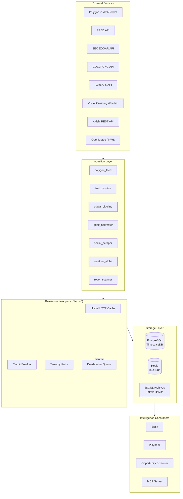
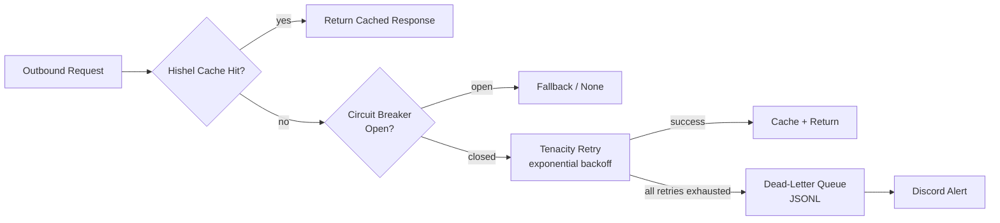

# Data Pipeline

Raw external data flows from nine distinct sources through ingestion harvesters into Postgres and the Redis Intel Bus, where it becomes actionable intelligence for the trading engines.

---

## Data Flow

---

## Data Freshness

| Source | Harvester | Update Frequency | Latency | Storage |
|---|---|---|---|---|
| Polygon tick data | polygon_feed | Real-time WebSocket | <100ms | raw_market_ticks (TimescaleDB) |
| FRED macro | fred_monitor | 1 hour | ~5s API | intel:fred_macro + JSONL |
| SEC EDGAR filings | edgar_pipeline | 10 min | ~2s API | edgar_filings_log + intel:edgar_filing |
| SEC Form 4 insider | edgar_pipeline | 30 min | ~2s API | intel:edgar_insider |
| XBRL fundamentals | edgar_pipeline | Daily 06:00 UTC | ~10s | edgar_fundamentals |
| GDELT geopolitical | gdelt_harvester | 15 min | ~3s API | JSONL + intel:geopolitical |
| Social / Twitter | social_scraper | Continuous | ~1s | sentiment_logs + intel:sentiment_score |
| Weather | weather_alpha | 1 hour | ~2s API | intel:weather_signal |
| Kalshi markets | rover_scanner | 30s WebSocket | <500ms | intel:kalshi_signal |

---

## Resilience Stack (Step 48)

All external HTTP calls are wrapped at `core/resilience.py`:

- **Hishel**: HTTP response caching with configurable TTL per endpoint
- **Aiobreaker**: Circuit breaker — opens after 5 failures, half-open after 60s
- **Tenacity**: Exponential backoff retry — 3 attempts, jitter, max 30s wait
- **Dead-letter queue**: Failed events written to JSONL for manual review / replay

---

## TimescaleDB Optimizations

The `raw_market_ticks` table is a hypertable with:

- **CAGG**: `market_ticks_1min` continuous aggregate (1-min OHLCV rollup)
- **Compression**: 7-day policy — older chunks compressed automatically
- **Retention**: 90-day policy — data older than 90 days auto-dropped
- **HNSW index**: `intel_embeddings` table uses pgvector HNSW (m=16, ef=200) for semantic similarity search

---

## JSONL Archive

Every harvester writes a parallel JSONL archive to `/mnt/archive/<service>/` in addition to Postgres. This provides:

- An offline backup independent of database health
- Input for the cryptographic audit trail verifier (`scripts/verify.py`)
- A data source buyers can inspect directly without database access
