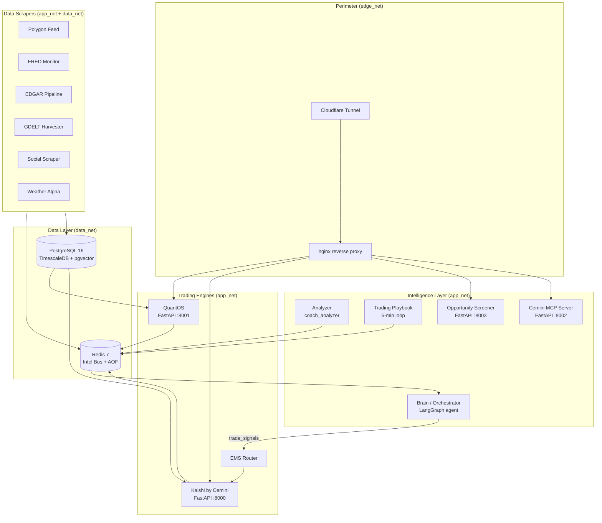
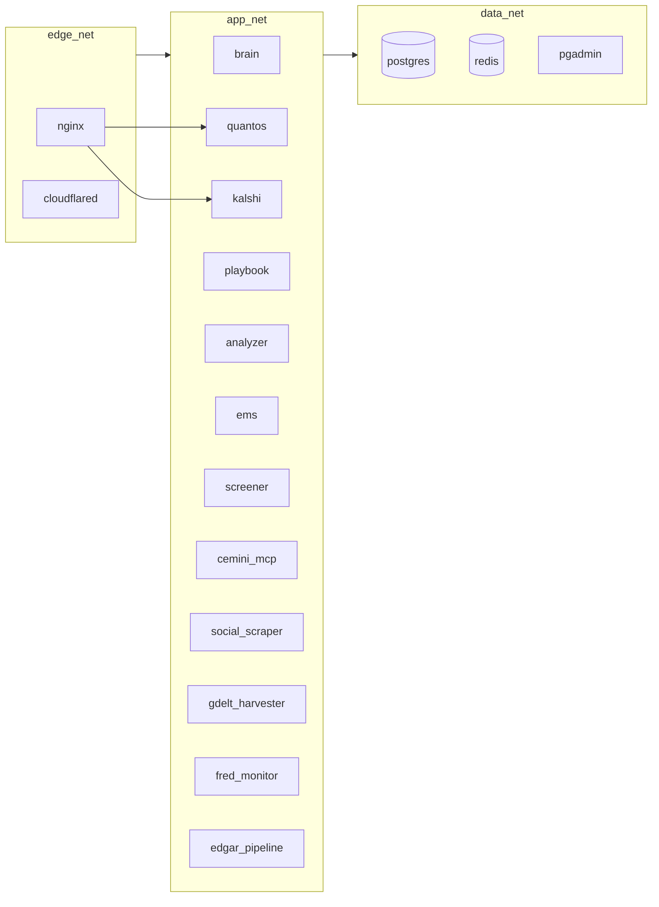

# System Overview

Cemini Financial Suite is built on three cooperating engines that share intelligence via Redis pub/sub, with a risk-gated observation layer (Trading Playbook) sitting above them. No engine has direct HTTP dependencies on another — they communicate exclusively through Redis channels.

---

## High-Level Architecture

---

## Design Philosophy

**Loosely coupled services.** Engines do not call each other over HTTP. The Redis Intel Bus (`intel:*` namespace) is the shared nervous system — any service can publish intelligence and any service can consume it without tight coupling.

**Intelligence-in, ticker-out.** The Opportunity Screener (Step 26) and Playbook continuously watch the Intel Bus for cross-source confluence. When multiple intelligence signals align on the same ticker, it surfaces as an opportunity. The downstream machinery (QuantOS, Kalshi) evaluates it independently.

**Risk-first execution.** No signal reaches the EMS without traversing the regime gate (macro_regime classifier), fractional Kelly sizing, CVaR check, and DrawdownMonitor. The Kill Switch can halt everything in under 100ms.

**Verifiable track record.** Every scan intention is logged to the cryptographic audit trail before evaluation runs. This prevents selective reporting and provides buyers with proof that historical results are real.

---

## Network Segmentation

Services on `data_net` are not reachable from the internet. Only `app_net` services can talk to `data_net`. The perimeter layer (`edge_net`) forwards inbound traffic to specific app services via nginx.

---

## Key Architectural Decisions

| Decision | Rationale | Alternative Considered |
|---|---|---|
| Redis as sole inter-service bus | Zero coupling; any service can be replaced without breaking others | Direct HTTP between services — rejected (tight coupling, cascade failures) |
| TimescaleDB over plain Postgres | Time-series compression + CAGG rollups for tick data at scale | InfluxDB — rejected (separate infra, no SQL) |
| pgvector for embeddings | Co-located with operational data; killer SQL: semantic search JOINed with tick data | Pinecone/Weaviate — rejected (external dependency, cost) |
| Single VPS (Hetzner) | Cost-effective for private use; Docker Swarm adds redundancy overlay | Multi-node cluster — rejected (over-engineered for current scale) |
| Observation-only playbook | Risk-first: test signals in paper mode before live execution | Live-first — rejected (unacceptable without proven track record) |
| LangGraph orchestrator | Natural fit for stateful, graph-based agent workflows | Custom async loop — rejected (reinventing the wheel) |
