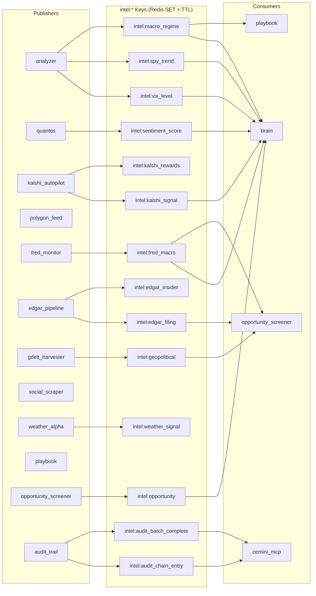

# Redis Intel Bus

The Redis Intel Bus is the shared nervous system of Cemini Financial Suite. All inter-service intelligence flows through a unified `intel:*` key namespace. Services publish with `SET` (TTL-keyed) and read with `GET` — no pub/sub polling overhead.

---

## Channel Map



---

## Channel Catalog

| Channel | Publisher | TTL | Refresh | Payload |
|---|---|---|---|---|
| `intel:vix_level` | analyzer | 300s | 4 min | `float` — VIX proxy value |
| `intel:spy_trend` | analyzer | 300s | 4 min | `"bullish"` / `"neutral"` / `"bearish"` |
| `intel:macro_regime` | analyzer | 300s | 4 min | `RegimeState` JSON (GREEN/YELLOW/RED) |
| `intel:sentiment_score` | quantos | 600s | 10 min | `float` — FinBERT aggregate |
| `intel:kalshi_signal` | kalshi_autopilot | 120s | 30s | Kalshi opportunity JSON |
| `intel:kalshi_rewards` | kalshi_rewards cron | 86400s | daily | Kalshi rewards program JSON |
| `intel:fred_macro` | fred_monitor | 3600s | 1 hr | FRED indicators dict |
| `intel:edgar_filing` | edgar_pipeline | 600s | 10 min | Latest EDGAR filing JSON |
| `intel:edgar_insider` | edgar_pipeline | 1800s | 30 min | Form 4 insider trade JSON |
| `intel:geopolitical` | gdelt_harvester | 900s | 15 min | GDELT event aggregate JSON |
| `intel:weather_signal` | weather_alpha | 3600s | 1 hr | Weather arbitrage signal JSON |
| `intel:opportunity` | opportunity_screener | 300s | 30s | Top discovery candidates JSON |
| `intel:audit_chain_entry` | audit_trail | 300s | per-event | Latest hash chain entry JSON |
| `intel:audit_batch_complete` | audit_trail | 86400s | daily | Merkle batch commitment JSON |

---

## IntelPublisher / IntelReader Pattern

```python
# Publishing (uses SET, not PUBLISH — allows TTL control)
from shared.intel_bus import IntelPublisher

pub = IntelPublisher()
pub.publish("intel:macro_regime", regime_dict, ttl=300)

# Reading (uses GET)
from shared.intel_bus import IntelReader

reader = IntelReader()
regime = reader.get("intel:macro_regime")  # returns dict or None
```

**Key design choice:** `SET` with TTL rather than `PUBLISH` + subscriber. This allows:

- Any service to read the latest value at any time (not just at publish time)
- Stale detection — if TTL expires, callers receive `None` and fall back gracefully
- The MCP server to expose all Intel Bus values as read-only tools without subscribing

---

## Trade Signal Channels

Separate from the `intel:*` namespace, two critical pub/sub channels drive execution:

| Channel | Publisher | Subscribers | Purpose |
|---|---|---|---|
| `trade_signals` | brain | EMS, kalshi_autopilot | Execution commands with regime gate applied |
| `emergency_stop` | kill_switch, panic_button | EMS, kalshi_autopilot | CANCEL_ALL broadcast — halt all trading |
| `strategy_mode` | analyzer, brain | All engines | `conservative` / `aggressive` / `sniper` mode |
