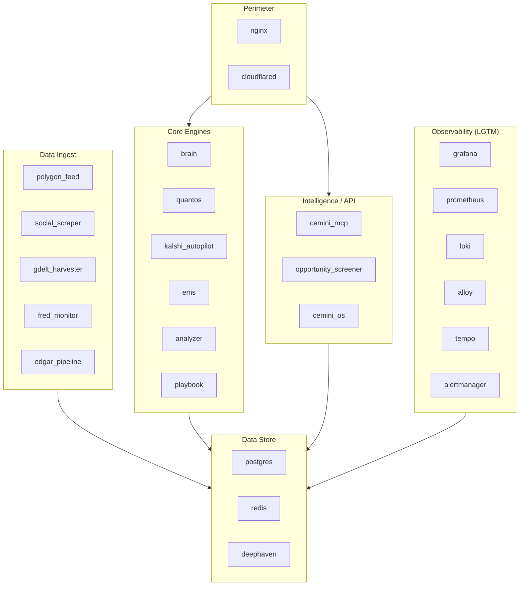

# Docker Services

All 34 services are defined in `docker-compose.yml` and managed as a single Compose stack (with Docker Swarm overlay for resource limits and rolling updates).

---

## Service Inventory

| Service | Purpose | Port(s) | Restart | Networks |
|---|---|---|---|---|
| `postgres` | Primary data store (PostgreSQL 16 + TimescaleDB + pgvector) | 5432 (internal) | always | data_net |
| `redis` | Intel Bus + trade signal pub/sub + AOF persistence | 6379 (internal) | always | data_net |
| `pgadmin` | Postgres management UI | 5050 → nginx | always | data_net |
| `nginx` | Reverse proxy + TLS termination | 80, 443 | always | edge_net, app_net |
| `cloudflared` | Cloudflare Tunnel (zero-trust inbound) | — | always | edge_net |
| `brain` | LangGraph orchestrator + EMS signal router | — | always | app_net, data_net |
| `analyzer` | Coach analyzer (regime + intel broadcaster) | — | always | app_net, data_net |
| `ems` | Execution Management System router | — | always | app_net, data_net |
| `quantos` | Stock/crypto signal engine (FastAPI) | 8001 → nginx | always | app_net, data_net |
| `kalshi_autopilot` | Kalshi prediction market engine (FastAPI) | 8000 → nginx | always | app_net, data_net |
| `playbook` | Trading Playbook observation loop | — | always | app_net, data_net |
| `cemini_mcp` | MCP Intelligence Server (FastAPI) | 8002 → nginx | always | app_net, data_net |
| `opportunity_screener` | Opportunity Discovery Engine (FastAPI) | 8003 → nginx | always | app_net, data_net |
| `cemini_os` | Performance Dashboard (Streamlit) | 8501 → nginx | always | app_net, data_net |
| `polygon_feed` | Polygon.io WebSocket tick data harvester | — | always | app_net, data_net |
| `social_scraper` | X/Twitter + sentiment harvester | — | always | app_net, data_net |
| `gdelt_harvester` | GDELT geopolitical event harvester | — | always | app_net, data_net |
| `fred_monitor` | FRED macro indicator harvester | — | always | app_net, data_net |
| `edgar_pipeline` | SEC EDGAR filings + insider + XBRL harvester | — | always | app_net, data_net |
| `macro_scraper` | Macro data aggregator | — | always | app_net, data_net |
| `rover_scanner` | Kalshi market scanner (WebSocket) | — | always | app_net, data_net |
| `signal_generator` | Legacy signal generation bridge | — | always | app_net, data_net |
| `logger` | Scribe logger (trade history + audit JSONL) | — | always | app_net, data_net |
| `deephaven` | Deephaven real-time analytics engine | 10000 → nginx | always | app_net, data_net |
| `grafana` | Grafana dashboard (LGTM stack) | 3000 → nginx /grafana/ | always | app_net, data_net |
| `prometheus` | Metrics collection (LGTM stack) | 9090 (internal) | always | app_net, data_net |
| `alertmanager` | Alert routing (LGTM stack) | 9093 (internal) | always | app_net, data_net |
| `loki` | Log aggregation (LGTM stack) | 3100 (internal) | always | app_net, data_net |
| `alloy` | Grafana Alloy collector (LGTM stack) | 12345 (internal) | always | app_net, data_net |
| `tempo` | Distributed tracing (LGTM stack) | 3200 (internal) | always | app_net, data_net |
| `redis-exporter` | Redis metrics for Prometheus | 9121 (internal) | always | app_net, data_net |
| `postgres-exporter` | Postgres metrics for Prometheus | 9187 (internal) | always | app_net, data_net |
| `node-exporter` | Host metrics for Prometheus | 9100 (internal) | always | app_net |
| `portainer` | Docker management UI | → nginx /portainer/ | always | app_net |
| `dbmate` | Schema migration runner (exits after up) | — | no | data_net |

---

## Service Groups

---

## Health Checks

All 33 persistent services have health checks defined. Key patterns:

- **HTTP services** (quantos, kalshi, cemini_mcp, opportunity_screener): `curl -f http://localhost:{port}/health`
- **Postgres**: `pg_isready -U admin`
- **Redis**: `redis-cli -a $REDIS_PASSWORD ping`
- **Grafana/Prometheus**: HTTP probe on health endpoint
- **Distroless containers** (loki, tempo, redis-exporter): `CMD` binary invocation (no shell available)
- **Alloy**: `/dev/tcp` port check (has bash)

The `dbmate` service has `restart_policy: none` — it runs migrations once and exits cleanly.
