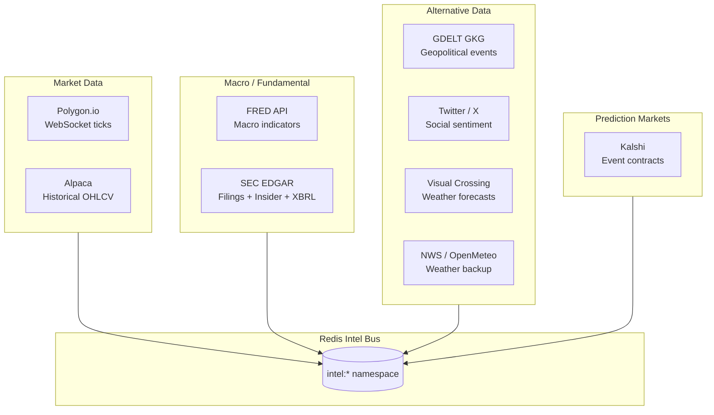

# Data Sources Overview

Cemini Financial Suite ingests from nine distinct external data pipelines. All data flows through resilience wrappers (Hishel cache + circuit breaker + Tenacity retry) before reaching Postgres or the Redis Intel Bus.

---

## Source Map

---

## Source Summary

| Source | Type | Harvester | Update Freq | Key Intel Channel |
|---|---|---|---|---|
| Polygon.io | Real-time tick data | polygon_feed | WebSocket continuous | raw_market_ticks |
| Alpaca | OHLCV historical | quantos | On-demand | — (direct DB) |
| FRED | Macro indicators | fred_monitor | 1 hour | intel:fred_macro |
| SEC EDGAR | Filings + Form 4 + XBRL | edgar_pipeline | 10/30 min / daily | intel:edgar_filing |
| GDELT GKG | Geopolitical events | gdelt_harvester | 15 min | intel:geopolitical |
| Twitter / X | Social sentiment | social_scraper | Continuous | intel:sentiment_score |
| Visual Crossing | Weather forecasts | weather_alpha | 1 hour | intel:weather_signal |
| NWS / OpenMeteo | Weather backup | weather_alpha | 1 hour | intel:weather_signal |
| Kalshi | Prediction markets | rover_scanner | 30s WebSocket | intel:kalshi_signal |

---

## Cost Architecture

The platform targets **$135–272/month** in external API costs:

| Service | Cost | Role |
|---|---|---|
| Alpaca Algo Trader Plus | ~$99/mo | Core equity data spine |
| Polygon.io | ~$29/mo | Real-time WebSocket ticks |
| FRED | Free | Macro indicators |
| SEC EDGAR | Free | Filings, insider trades, XBRL |
| GDELT | Free | Geopolitical events |
| Visual Crossing | ~$8/mo | Weather data |
| Twitter / X | Varies | Social sentiment |

The elimination of `sec-api.io` ($49/mo) in Step 40 reduced data costs by ~26%.

---

## Data Quarantine

Pre-Step-26 data is quarantined at `/opt/cemini/archives/data_quarantine/`. This data was accumulated before the Signal Catalog, regime gate, and audit trail were in place. It is **not** used for model training or backtesting — it exists for historical reference only.

See `CLAUDE.md` for quarantine policy details.
