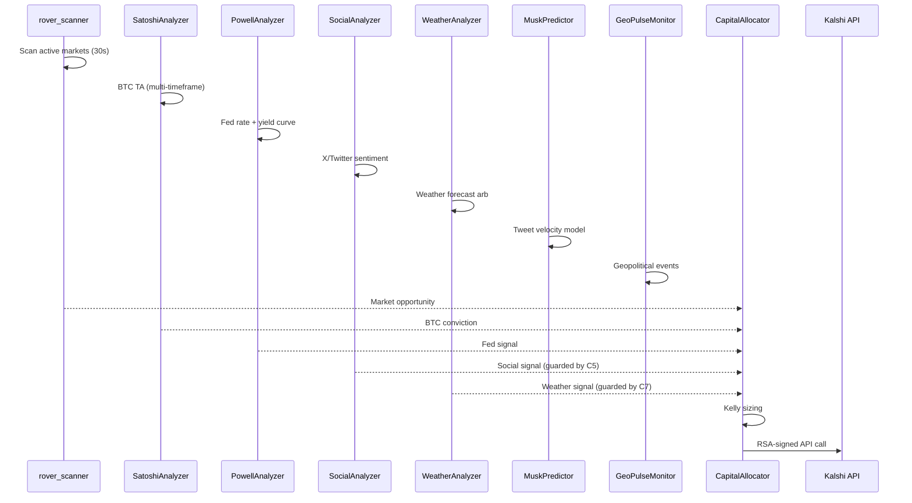

# Kalshi by Cemini

The Kalshi engine is a prediction market trading system targeting Kalshi's regulated event contracts. It runs as a FastAPI service on port 8000 and continuously scans for arbitrage opportunities across Bitcoin TA, Fed rate expectations, weather forecasts, social signals, and geopolitical events.

---

## Purpose

- Scan Kalshi prediction market contracts every 30 seconds
- Multi-analyzer intelligence fusion (BTC, Powell, Social, Weather, Musk, GeoPulse)
- Kelly Criterion position sizing for prediction market bets
- Direct RSA-signed API calls to Kalshi's trade API
- Active prediction market trading (not paper mode for Kalshi)

---

## Key Files

| File | Role |
|---|---|
| `Kalshi by Cemini/cemini_autopilot.py` | Main autopilot — scan_and_execute() loop |
| `Kalshi by Cemini/analyzers/satoshi.py` | BTC multi-timeframe TA |
| `Kalshi by Cemini/analyzers/powell.py` | Fed rate + yield curve analysis |
| `Kalshi by Cemini/analyzers/social.py` | X/Twitter + TextBlob sentiment |
| `Kalshi by Cemini/analyzers/weather.py` | NWS/Visual Crossing weather arb |
| `Kalshi by Cemini/analyzers/musk.py` | Elon tweet velocity model |
| `Kalshi by Cemini/analyzers/geo_pulse.py` | Geopolitical signal monitor |
| `Kalshi by Cemini/market_rover.py` | Kalshi market scanner |
| `Kalshi by Cemini/capital_allocator.py` | Kelly Criterion position sizing |

---

## Signal Fusion Flow

---

## Safety Guards

| Guard | Variable | Default | Effect |
|---|---|---|---|
| C5 | `SOCIAL_ALPHA_LIVE=true` | Off | Social/sentiment signals gated to neutral |
| C7 | `WEATHER_ALPHA_LIVE=true` | Off | Weather signals gated to neutral |

These guards prevent live alpha signals from feeding Kalshi bets until explicitly enabled.

---

## Redis Channels

| Channel | Direction | Purpose |
|---|---|---|
| `intel:kalshi_signal` | Write | Latest opportunity (TTL 120s) |
| `intel:kalshi_rewards` | Write | Rewards program (TTL 86400s) |
| `trade_signals` | Read | Brain-approved signals |
| `emergency_stop` | Read | Kill switch — cancels all resting orders |

---

## QuantOS Bridge

The Kalshi engine calls `QuantOS :8001/api/sentiment` over HTTP for FinBERT sentiment scores. This is the only direct HTTP dependency between engines (all other communication is via Redis).
