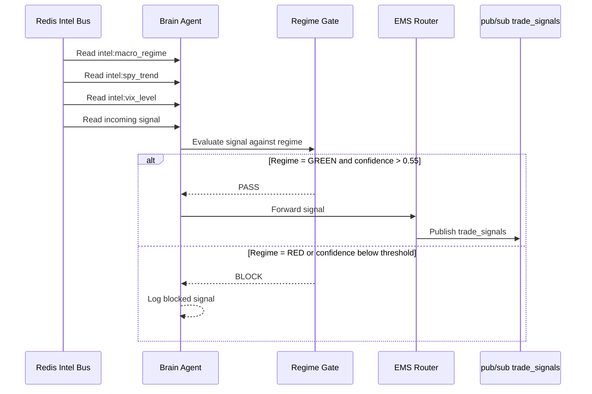

# Root Orchestrator (Brain)

The Brain is the central orchestrator of Cemini Financial Suite. It is a LangGraph-based agent that reads regime and intelligence signals from the Redis Intel Bus, applies the regime gate, and routes approved trade signals to the EMS.

---

## Purpose

- Consume signals from QuantOS and Kalshi via the Intel Bus
- Apply the macro regime gate — block trades when regime is RED or thresholds not met
- Forward regime-approved signals to the EMS via the `trade_signals` pub/sub channel
- Maintain strategy mode (`conservative` / `aggressive` / `sniper`) based on real-time conditions

---

## Key Files

| File | Role |
|---|---|
| `agents/brain.py` | LangGraph graph definition and main agent loop |
| `agents/regime_gate.py` | Regime gate logic — thresholds per regime (GREEN/YELLOW/RED) |
| `agents/ems_router.py` | Routes approved signals to EMS pub/sub |
| `Dockerfile.brain` | Bakes `agents/`, `cemini_contracts/`, `logit_pricing/` into image |

---

## Decision Flow

---

## Regime Gate Thresholds

| Regime | BUY threshold | SELL/SHORT threshold | Catalyst bonus |
|---|---|---|---|
| GREEN | 0.55 | 0.55 | — |
| YELLOW | 0.71 | 0.50 | +0.10 for EpisodicPivot / InsideBar212 |
| RED | 0.74 | 0.45 | +0.10 for EpisodicPivot / InsideBar212 |

The catalyst bonus applies only in YELLOW/RED — it rewards high-conviction setups in difficult market conditions.

---

## Redis Channels

| Channel | Direction | Purpose |
|---|---|---|
| `intel:macro_regime` | Read | Current regime (GREEN/YELLOW/RED) |
| `intel:spy_trend` | Read | SPY trend context |
| `intel:vix_level` | Read | VIX proxy for fear/greed |
| `trade_signals` | Write | Regime-approved signals to EMS |
| `strategy_mode` | Read | Current strategy posture |
| `emergency_stop` | Read | Kill switch halt signal |

---

## Notes for Buyers

- The Brain's Dockerfile **bakes** agent code into the image — code changes require a `docker compose build brain` rebuild.
- The `coach_analyzer` service runs separately and publishes regime data to the Intel Bus every 4 minutes, ensuring the Brain always has fresh regime context.
- In paper mode, the Brain generates signals but the EMS adapters do not place live orders.
