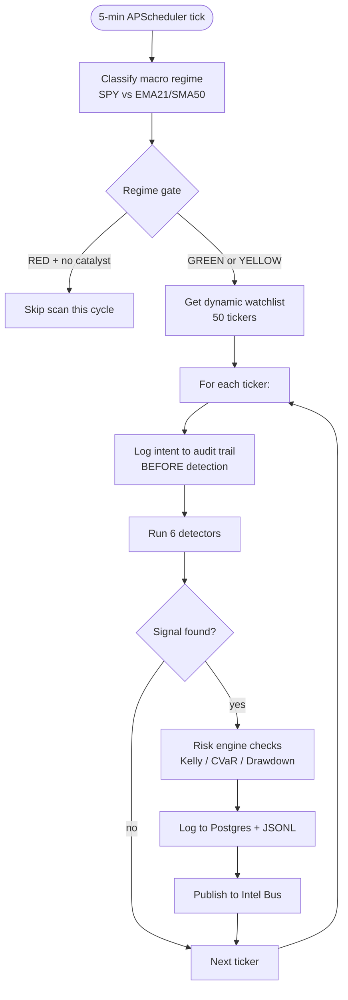

# Trading Playbook

The Trading Playbook is the observation-only intelligence layer. It does **not** place orders. Its purpose is to run a continuous regime + signal + risk evaluation loop, log every decision to the cryptographic audit trail, and publish intelligence to the Redis Intel Bus for downstream engines.

---

## Purpose

- Continuous 5-minute scan loop over a dynamic watchlist
- Apply macro regime classification (GREEN/YELLOW/RED) before any signal evaluation
- Run six technical pattern detectors per ticker
- Apply risk controls (Fractional Kelly, CVaR, DrawdownMonitor) to every signal
- Log pre-evaluation intent to the cryptographic audit trail
- Publish playbook intelligence to the Intel Bus

---

## Key Files

| File | Role |
|---|---|
| `trading_playbook/signal_catalog.py` | Six pattern detectors + scan_symbol() with intent logging |
| `trading_playbook/macro_regime.py` | SPY/EMA21/SMA50 + JNK/TLT regime classifier |
| `trading_playbook/risk_engine.py` | FractionalKelly, CVaRCalculator, DrawdownMonitor |
| `trading_playbook/kill_switch.py` | Five-condition halt with CANCEL_ALL broadcast |
| `trading_playbook/playbook_logger.py` | Postgres + JSONL logging with hash chain integration |
| `trading_playbook/runner.py` | APScheduler 5-min loop orchestrator |

---

## 5-Minute Scan Loop

---

## Observation-Only Design

The playbook is intentionally read-only. It:

- Reads OHLCV data from Postgres / yfinance
- Classifies signals and computes position sizes
- Logs everything to the audit trail and Intel Bus
- Does **not** write to `trade_signals` channel
- Does **not** call any broker adapter

The signal output is consumed by the Brain, which applies the regime gate independently before any execution decision.

---

## Six Signal Detectors

| Detector | Pattern | Min Rows | Key Condition |
|---|---|---|---|
| EpisodicPivot | Sudden high-volume breakout above resistance | 20 | Volume spike >2× avg + price breakout |
| MomentumBurst | Multi-bar acceleration in price + volume | 10 | Consecutive closes above prior high |
| ElephantBar | Single oversized bullish candle | 5 | Bar range >2× ATR, close in top 25% |
| VCP | Volatility Contraction Pattern (Minervini) | 60 | 3 contracting waves, volume dry-up |
| HighTightFlag | 100%+ move in 8 weeks, tight 3-week flag | 60 | Strict Weinstein Stage 2 criteria |
| InsideBar212 | 2-1-2 inside bar compression | 5 | Three bars: outer, inside, breakout |

---

## Risk Controls Applied

Every signal that passes detection is evaluated through:

1. **FractionalKelly** — 25% cap on Kelly optimal sizing; floor at 0.5%, ceiling at 10% of NAV
2. **CVaRCalculator** — 99th percentile Expected Shortfall from return distribution
3. **DrawdownMonitor** — per-strategy and portfolio-level equity peak tracking

Signals that fail any risk gate are logged as "blocked" with reason — these still appear in the audit trail.

---

## Intel Bus Output

| Channel | Content | TTL |
|---|---|---|
| `intel:macro_regime` | Current regime state JSON | 300s |
| `intel:spy_trend` | SPY trend direction | 300s |
| `intel:vix_level` | VIX proxy value | 300s |
| `intel:audit_chain_entry` | Latest hash chain entry | 300s |
