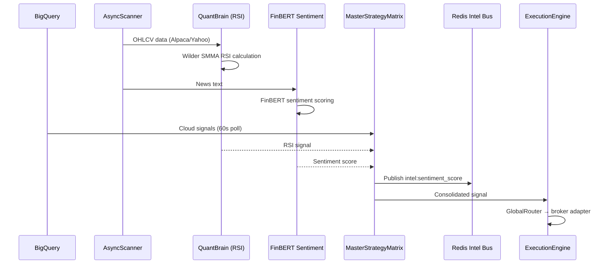

# QuantOS

QuantOS is the stock and cryptocurrency signal engine. It runs as a FastAPI service on port 8001 and continuously scans equities and crypto for entry opportunities using RSI, FinBERT sentiment, and BigQuery-backed cloud signals.

---

## Purpose

- RSI-based momentum signals across equities and crypto
- FinBERT NLP sentiment scoring on financial news
- BigQuery cloud signal polling (60-second interval)
- Publishes sentiment scores to Intel Bus for cross-engine fusion
- Hosts a Jinja2 HTML UI (dashboard, analytics, backtester)

---

## Key Files

| File | Role |
|---|---|
| `QuantOS/brain/quant_brain.py` | RSI calculation (Wilder's SMMA), signal logic |
| `QuantOS/strategy/master_strategy.py` | MasterStrategyMatrix — aggregates signal sources |
| `QuantOS/execution/engine.py` | ExecutionEngine — GlobalRouter → broker adapters |
| `QuantOS/interface/server.py` | FastAPI app — `/api/sentiment`, `/health`, UI routes |
| `QuantOS/data/harvester.py` | BigQuery streaming, 2s flush |

---

## Signal Flow



---

## RSI Implementation

QuantOS uses **Wilder's Smoothed Moving Average (SMMA)** — the industry-standard RSI formulation matching pandas-ta, TradingView, and Wilder 1978:

```
seed = SMA of first `period` deltas
avg_gain = (prev_gain * (period-1) + current_gain) / period
avg_loss = (prev_loss * (period-1) + current_loss) / period
RSI = 100 - (100 / (1 + avg_gain/avg_loss))
```

The previous SMA-based implementation was corrected in the Desloppify sprint (Mar 8, 2026).

---

## Broker Adapters

| Adapter | Asset Class | Mode |
|---|---|---|
| Alpaca | Equities | Paper (default) |
| IBKR | Equities | Paper |
| Robinhood | Equities / Crypto | Paper |
| SoFi | Equities | Paper |
| Webull | Equities | Paper |
| Schwab | Equities | Paper |
| Coinbase | Crypto | Paper |

All adapters default to paper mode. Live execution requires explicit activation via environment variables.

---

## Redis Channels

| Channel | Direction | Purpose |
|---|---|---|
| `intel:sentiment_score` | Write | FinBERT aggregate (TTL 600s) |
| `trade_signals` | Read | Regime-approved signals from Brain |
| `strategy_mode` | Read | Current strategy posture |
| `emergency_stop` | Read | Kill switch |
