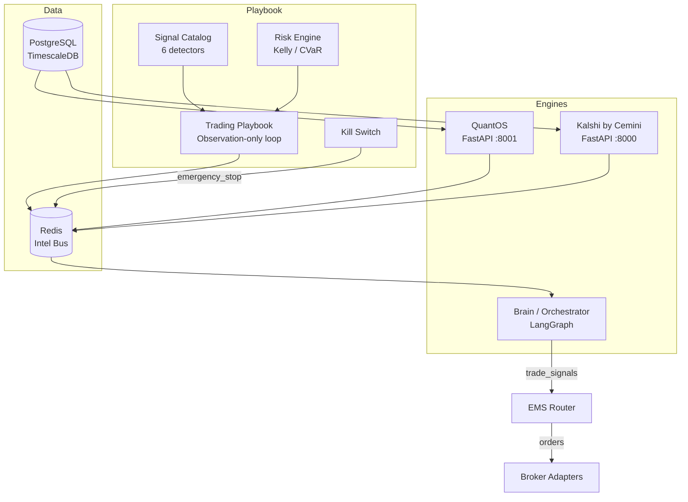

# Cemini Financial Suite

**Proprietary Algorithmic Trading Platform — Due Diligence Package**

---

Cemini Financial Suite is a modular, Dockerized algorithmic trading platform built for private use and designed for IP sale. It integrates real-time market data ingestion, multi-source intelligence fusion, regime-gated signal generation, risk-controlled order execution, and a cryptographic audit trail into a single deployable stack on a single Hetzner VPS.

**Current state:** 24 of 51 roadmap steps complete — 764 tests passing — paper trading mode (no live equity/crypto orders).

---

## Key Differentiators

### 1. Cryptographic Audit Trail

Every signal evaluation is immutably recorded before a trade decision is made. A three-layer architecture — SHA-256 hash chain (Layer 1), pymerkle daily Merkle tree (Layer 2), and OpenTimestamps Bitcoin anchoring (Layer 3) — proves that the track record cannot be backdated, cherry-picked, or tampered with. Buyers receive an offline verifier script and raw JSONL chain files.

See [Cryptographic Audit Trail](verification/audit-trail.md).

### 2. Multi-Source Intelligence Fusion

Nine distinct data pipelines feed a Redis-backed Intel Bus: Polygon tick data, FRED macro indicators, SEC EDGAR filings, GDELT geopolitical events, Twitter/X sentiment, Visual Crossing weather, Kalshi prediction markets, and a pgvector semantic intelligence layer. The platform converts raw external signals into a unified `intel:*` namespace consumed by all engines.

See [Data Sources Overview](data-sources/overview.md).

### 3. Resilient Data Pipeline

All external HTTP calls are wrapped with Hishel caching, Aiobreaker circuit breakers, and Tenacity retry logic. A dead-letter queue captures failed ingestion events for audit. APScheduler manages all recurring jobs with deterministic scheduling. The platform degrades gracefully when data sources are unavailable.

See [Pipeline Resilience](infrastructure/resilience.md).

### 4. Six-Detector Signal Catalog

The Trading Playbook runs six proven technical pattern detectors — EpisodicPivot, MomentumBurst, ElephantBar, VCP, HighTightFlag, and InsideBar212 — in a continuous observation loop. Every scan logs pre-evaluation intent to the audit trail before detection runs, preventing selective reporting.

See [Signal Catalog](intelligence/signal-catalog.md).

### 5. Risk-First Architecture

No trade signal reaches the execution layer without passing through Fractional Kelly position sizing (25% cap), CVaR 99th-percentile risk calculation, and DrawdownMonitor checks. The Kill Switch provides five independent halt conditions with `CANCEL_ALL` broadcast to all adapters. The playbook is observation-only by design.

See [Risk Engine](intelligence/risk-engine.md) and [Kill Switch](intelligence/kill-switch.md).

---

## Tech Stack

| Layer | Technology |
|---|---|
| Orchestrator | LangGraph (Brain agent) |
| Signal Engines | FastAPI (QuantOS :8001, Kalshi :8000) |
| Playbook | Python APScheduler loop |
| Data Store | PostgreSQL 16 + TimescaleDB + pgvector |
| Cache / Intel Bus | Redis 7 (auth-required, AOF persistence) |
| ML / NLP | FinBERT sentiment, all-MiniLM-L6-v2 embeddings |
| Pricing | Logit jump-diffusion library (custom) |
| Observability | Prometheus + Loki + Alloy + Tempo + Grafana |
| Containers | Docker Compose (34 services) + Docker Swarm single-node |
| CI/CD | GitHub Actions — Ruff → Trivy → Semgrep → pip-audit → SSH deploy |
| Audit | pymerkle + OpenTimestamps + SHA-256 hash chain |
| Schema Migrations | dbmate 2.31.0 |
| Perimeter | nginx + Cloudflare Tunnel |

---

## Architecture at a Glance

---

## Quick Navigation

| I want to understand... | Go to |
|---|---|
| How all services fit together | [System Overview](architecture/overview.md) |
| The cryptographic audit trail | [Verification](verification/audit-trail.md) |
| Signal detection logic | [Signal Catalog](intelligence/signal-catalog.md) |
| Risk controls | [Risk Engine](intelligence/risk-engine.md) |
| CI/CD pipeline | [CI/CD](qa/ci-cd.md) |
| All Docker services | [Docker Services](architecture/services.md) |
| Known issues | [Technical Debt](appendices/tech-debt.md) |
| License compliance | [Licenses](appendices/licenses.md) |
