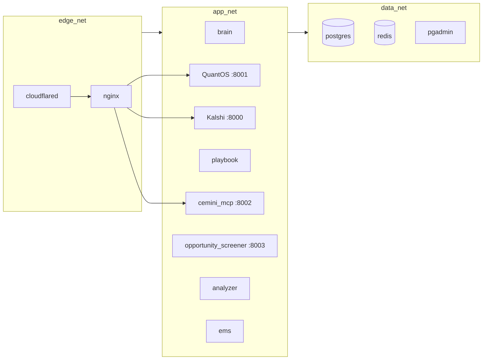

# DevOps & Security

Step 34 hardened the Cemini deployment stack across six dimensions: container
orchestration, runtime type checking, static analysis, vulnerability scanning,
custom security rules, and deployment infrastructure.

---

## Docker Swarm + Single-Node Deployment

Cemini runs as a **Docker Swarm single-node** stack on a Hetzner VPS
(Ubuntu 24, 5.161.53.103). This provides:

- **Rolling updates** with `docker service update --image` — zero-downtime deploys
- **Restart policies** via `deploy.restart_policy` (condition: on-failure, delay: 5s, max: 3)
- **Resource limits** via `deploy.resources.limits` on all 35+ services
- **Health check integration** — Swarm respects `healthcheck:` before routing traffic

```bash
# Initialize Swarm (run once outside market hours)
scripts/swarm-init.sh

# Deploy as stack
docker stack deploy -c docker-compose.yml cemini

# Check service status
docker service ls
```

!!! warning "Swarm Init Timing"
    Run `swarm-init.sh` outside market hours (9:30 AM – 4:00 PM ET, Mon–Fri).
    Container restarts during swarm init can briefly interrupt data collection.

---

## Network Segmentation

Three isolated Docker networks enforce strict service-to-service communication rules:



| Network | Services | Purpose |
|---|---|---|
| `edge_net` | nginx, cloudflared | Public-facing ingress only |
| `app_net` | All application services | Service-to-service communication |
| `data_net` | postgres, redis, pgadmin | Data layer isolation |

Services on `data_net` are unreachable from the public internet — only `app_net`
services can connect to Postgres and Redis.

---

## Health Checks

Every service in `docker-compose.yml` has a `healthcheck:` block:

```yaml
healthcheck:
  test: ["CMD", "curl", "-f", "http://localhost:8001/health"]
  interval: 30s
  timeout: 10s
  retries: 3
  start_period: 40s
```

| Service | Health Endpoint |
|---|---|
| QuantOS | `GET /health` |
| Kalshi by Cemini | `GET /health` |
| Cemini MCP | `GET /health` |
| Grafana | `GET /api/health` |
| Prometheus | `GET /-/healthy` |
| Loki | Binary: `/usr/bin/loki -version` |
| Tempo | Binary: `/tempo -version` |
| Redis Exporter | Binary: `/redis_exporter --version` |

Distroless containers (Loki, Tempo, redis_exporter) use CMD (not CMD-SHELL) because
they have no shell.

---

## Portainer CE (Container Management UI)

Portainer Community Edition is deployed for visual container management:

- **URL**: `https://your-domain/portainer/`
- **Port**: 9000 (nginx proxied at `/portainer/`)
- **Started with**: `--base-url /portainer` (required for sub-path serving)

nginx proxy configuration (WebSocket headers required for Portainer to function):

```nginx
location /portainer/ {
    proxy_pass http://portainer:9000/;
    proxy_http_version 1.1;
    proxy_set_header Upgrade $http_upgrade;
    proxy_set_header Connection "upgrade";
}
```

---

## Runtime Type Checking (beartype)

`@beartype` decorators enforce type annotations at runtime on 23 critical functions:

| Module | Functions Decorated |
|---|---|
| `ems/intel_bus.py` | `publish()`, `read()`, `subscribe()` |
| `trading_playbook/risk_engine.py` | `calculate()`, `check()`, `update()` |
| `trading_playbook/macro_regime.py` | `classify()`, `to_dict()` |
| `trading_playbook/kill_switch.py` | `check_conditions()`, `trigger()` |
| `logit_pricing/pricing_engine.py` | `price_contract()`, `assess()` |

beartype raises `BeartypeCallHintParamViolation` on type mismatches at call time,
preventing silent type coercion bugs that are common in dynamic Python.

```python
# Example: passing int instead of float raises immediately
@beartype
def calculate(win_rate: float, reward_risk: float) -> float:
    ...

calculate(50, 2.0)  # ❌ BeartypeCallHintParamViolation: int is not float
calculate(0.5, 2.0)  # ✅ passes
```

---

## Security Scanning Stack

| Tool | When | What |
|---|---|---|
| **Ruff** (S rules) | Every commit | bandit-equivalent static analysis |
| **Trivy FS** | CI (every push) | Dockerfile misconfigs, embedded secrets |
| **Trivy image** | Server-side, pre-deploy | CVEs in Docker image layers |
| **Semgrep** | CI (every push) | Custom trading-platform rules |
| **TruffleHog** | CI (every push) | Verified secrets in git history |
| **pip-audit** | CI (every push) | CVEs in Python dependencies |

---

See also: [CI/CD Pipeline](../qa/ci-cd.md) | [Observability](observability.md)
