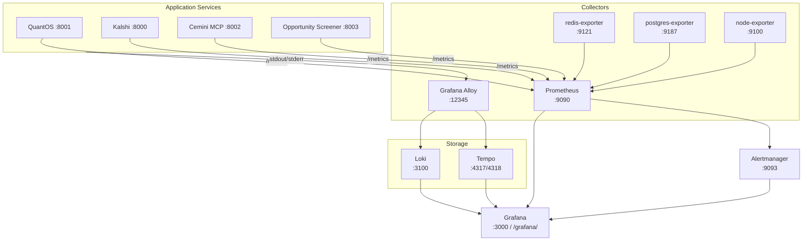

# Observability Stack (LGTM)

Step 35 deployed the full LGTM observability stack: **L**oki (logs), **G**rafana
(dashboards), **T**empo (traces), and **M**etrics via Prometheus. All 35+ services
emit metrics, logs are aggregated centrally, and distributed traces connect requests
across service boundaries.

---

## Stack Components



---

## Metrics (Prometheus)

Prometheus scrapes `/metrics` endpoints from all FastAPI services and system exporters.

### FastAPI Instrumentation

| Service | Library | Endpoint |
|---|---|---|
| QuantOS | `prometheus-fastapi-instrumentator` | `:8001/metrics` |
| Kalshi by Cemini | `prometheus-fastapi-instrumentator` | `:8000/metrics` |
| Opportunity Screener | `prometheus-fastapi-instrumentator` | `:8003/metrics` |
| Cemini MCP | `prometheus_client` (manual) | `:8002/metrics` |

Key metrics emitted:
- `http_requests_total` — request count by endpoint and status code
- `http_request_duration_seconds` — latency histogram
- `http_request_size_bytes` / `http_response_size_bytes` — payload sizes
- Custom: `cemini_signals_generated_total`, `cemini_regime_state` (gauge)

### System Exporters

| Exporter | Port | Metrics |
|---|---|---|
| node-exporter | 9100 | CPU, memory, disk, network |
| redis-exporter | 9121 | Redis ops/sec, memory, keyspace |
| postgres-exporter | 9187 | pg_stat_activity, vacuum, connections |

---

## Logs (Loki + Alloy)

Grafana Alloy (successor to Promtail/Agent) collects logs from all containers via
the Docker socket and ships them to Loki.

**Alloy config** (`monitoring/alloy/config.alloy`):
```
discovery.docker "containers" {
  host = "unix:///var/run/docker.sock"
}
loki.source.docker "docker_logs" {
  host       = "unix:///var/run/docker.sock"
  targets    = discovery.docker.containers.targets
  forward_to = [loki.write.default.receiver]
  relabeling {
    source_labels = ["__meta_docker_container_name"]
    target_label  = "container"
  }
}
```

Log labels: `container`, `compose_service`, `level` (parsed from log lines).

Alloy health check: `http://localhost:12345/-/ready`

---

## Traces (Tempo + OpenTelemetry)

Distributed tracing via `observability/tracing.py`:

```python
from observability.tracing import configure_tracing, instrument_fastapi

configure_tracing(service_name="quantos", tempo_endpoint="http://tempo:4317")
instrument_fastapi(app)
```

Traces flow from FastAPI request handlers through Intel Bus calls to Postgres queries,
providing end-to-end latency breakdown for slow requests.

`configure_tracing()` degrades gracefully if OpenTelemetry packages are unavailable
(guarded by `ImportError` suppression).

---

## Grafana Dashboards

Grafana is accessible at `/grafana/` (nginx proxied) and auto-provisions two dashboards
from `monitoring/grafana/provisioning/dashboards/`:

### System Overview (`cemini-overview.json`)
- CPU, memory, disk usage (from node-exporter)
- Redis memory and operations/sec
- PostgreSQL active connections and query rate
- Alertmanager alert state

### Trading Services (`cemini-trading-services.json`)
- Request rate per service (QuantOS, Kalshi, MCP, Opportunity Screener)
- P99 latency per endpoint
- Signal generation rate
- Regime state (GREEN/YELLOW/RED as gauge panel)

---

## Alerting (Alertmanager)

Alertmanager v0.27.0 with 8 alert rules in 2 groups:

**System group:**
- `HighCPUUsage`: CPU > 85% for 5 minutes
- `LowDiskSpace`: Available disk < 10%
- `HighMemoryUsage`: Memory > 90% for 5 minutes
- `ServiceDown`: Any scrape target down for > 2 minutes

**Trading group:**
- `RedisDown`: Redis exporter not reachable
- `PostgresDown`: Postgres exporter not reachable
- `HighAPILatency`: P99 latency > 2s for 5 minutes
- `SignalGenerationStopped`: No signals generated in 1 hour during market hours

Alerts are visible in the Grafana Alertmanager datasource panel.

---

## Known Limitation

`kalshi_autopilot` Prometheus target shows DOWN — the container is not currently
running (pre-existing condition from before Step 35). All other targets are UP.

---

## Resource Budget

| Container | Memory Limit |
|---|---|
| Prometheus | 150 MB |
| Loki | 200 MB |
| Alloy | 100 MB |
| Tempo | 150 MB |
| node/redis/postgres exporters | 32 MB each |
| Grafana | 128 MB |
| Alertmanager | 64 MB |

Total observability overhead: ~900 MB of a 4 GB VPS.
