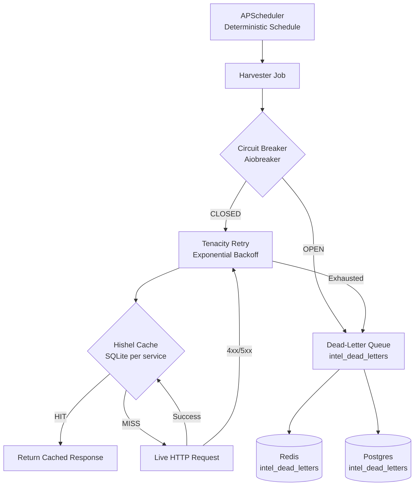

# Data Pipeline Resilience

Step 48 wrapped all external data ingestion with a four-layer resilience stack:
Hishel HTTP caching, Aiobreaker circuit breakers, Tenacity retry logic, and
APScheduler deterministic scheduling. A dead-letter queue captures failed events
for audit and replay.

---

## Architecture



---

## Layer 1: Hishel HTTP Caching

[Hishel](https://hishel.com/) is an RFC 7234-compliant HTTP caching library for httpx.
It prevents repeated identical requests from hitting external APIs:

```python
from core.resilience import create_resilient_client

# Async harvester
async with create_resilient_client("polygon_feed", cache_ttl=300) as client:
    response = await client.get("https://api.polygon.io/v2/aggs/...")
```

Cache storage is SQLite per service at `/tmp/hishel_cache/{service_name}/cache.db`.

| Service | Cache TTL | Rationale |
|---|---|---|
| Polygon tick data | 5 minutes | Market data changes frequently |
| FRED observations | 1 hour | Updated daily by Fed |
| EDGAR filings | 1 hour | New filings every 10 minutes at most |
| GDELT events | 15 minutes | Updated every 15 minutes |
| Visual Crossing weather | 30 minutes | Hourly forecast updates |

If Hishel is unavailable (import error), falls back to plain `httpx.AsyncClient`.

---

## Layer 2: Circuit Breaker (Aiobreaker)

The circuit breaker prevents cascading failures when an external API is down:

```python
from core.resilience import create_circuit_breaker

cb = create_circuit_breaker(
    fail_max=5,        # open after 5 consecutive failures
    timeout=60.0,      # try half-open after 60 seconds
)

@cb
async def fetch_polygon_data(symbol: str):
    ...
```

**States:**

| State | Behavior |
|---|---|
| **CLOSED** | Normal operation, requests pass through |
| **OPEN** | All requests fail immediately, payload → dead-letter queue |
| **HALF-OPEN** | One probe request allowed; success → CLOSED, failure → OPEN |

For synchronous harvesters, `SyncCircuitBreaker` provides the same behavior using
`threading.Lock` instead of asyncio.

---

## Layer 3: Tenacity Retry

[Tenacity](https://tenacity.readthedocs.io/) wraps individual HTTP calls with
exponential backoff retry logic:

```python
from core.resilience import create_retry_decorator

retry = create_retry_decorator(
    max_attempts=3,
    wait_min=1,    # seconds
    wait_max=30,   # seconds
)

@retry
def fetch_fred_series(series_id: str):
    ...
```

**Backoff schedule** (default `wait_exponential`):
- Attempt 1: immediate
- Attempt 2: ~2 seconds
- Attempt 3: ~4 seconds
- All attempts exhausted → exception propagates to circuit breaker

Retries are not attempted for 4xx client errors (non-transient failures).

---

## Layer 4: APScheduler (Deterministic Scheduling)

All recurring harvester jobs use APScheduler `AsyncIOScheduler`:

```python
from core.resilience import create_scheduler, add_harvester_job

scheduler = create_scheduler()
add_harvester_job(scheduler, fetch_polygon_data, interval_seconds=60)
scheduler.start()
```

APScheduler ensures:
- No overlapping executions (misfire grace period: 30 seconds)
- Jobs fire at exact intervals regardless of execution time
- Jobs survive container restarts (state is in-process, not persisted)

FRED fundamentals and EDGAR XBRL use cron triggers (daily at 06:00 UTC) via
`scheduler.add_job(..., trigger="cron", hour=6)` — not `add_harvester_job` which
is interval-only.

---

## Dead-Letter Queue

Failed events that exhaust all retries are written to the dead-letter queue:

```python
from core.resilience import dead_letter

dead_letter(
    source="polygon_feed",
    payload={"symbol": "AAPL", "error": "ConnectionError"},
)
```

Dead-letter entries are stored in:
1. **Redis**: `intel_dead_letters` list (no TTL — accumulates for replay)
2. **Postgres**: `intel_dead_letters` table (durable, queryable)

Schema:
```sql
CREATE TABLE intel_dead_letters (
    id          SERIAL PRIMARY KEY,
    source      TEXT NOT NULL,
    payload     JSONB NOT NULL,
    error_msg   TEXT,
    created_at  TIMESTAMPTZ DEFAULT NOW()
);
```

Operators can replay failed events by reading from `intel_dead_letters` and
resubmitting to the appropriate harvester.

---

## Resilience by Service

| Service | Hishel | Circuit Breaker | Tenacity | APScheduler |
|---|---|---|---|---|
| Polygon Feed | ✅ | ✅ | ✅ | ✅ |
| FRED Monitor | ✅ | ✅ | ✅ | ✅ (cron) |
| EDGAR Pipeline | ✅ | ✅ | ✅ | ✅ (interval + cron) |
| GDELT Harvester | ✅ | ✅ | ✅ | ✅ |
| Social Scraper | ✅ | ✅ | ✅ | ✅ |
| Visual Crossing | ✅ | ✅ | ✅ | ✅ |
| Kalshi Autopilot | — | ✅ | ✅ | — (event-driven) |

---

## Graceful Degradation

If a data source is unavailable, the system:

1. Serves the most recent cached value (Hishel)
2. If cache is expired, publishes a `data_unavailable` flag to the Intel Bus
3. Brain/Playbook treat missing intel as neutral (no position changes)
4. Dead-letter queue accumulates missed events for replay when the source recovers

The platform never halts due to a single data source failure.
