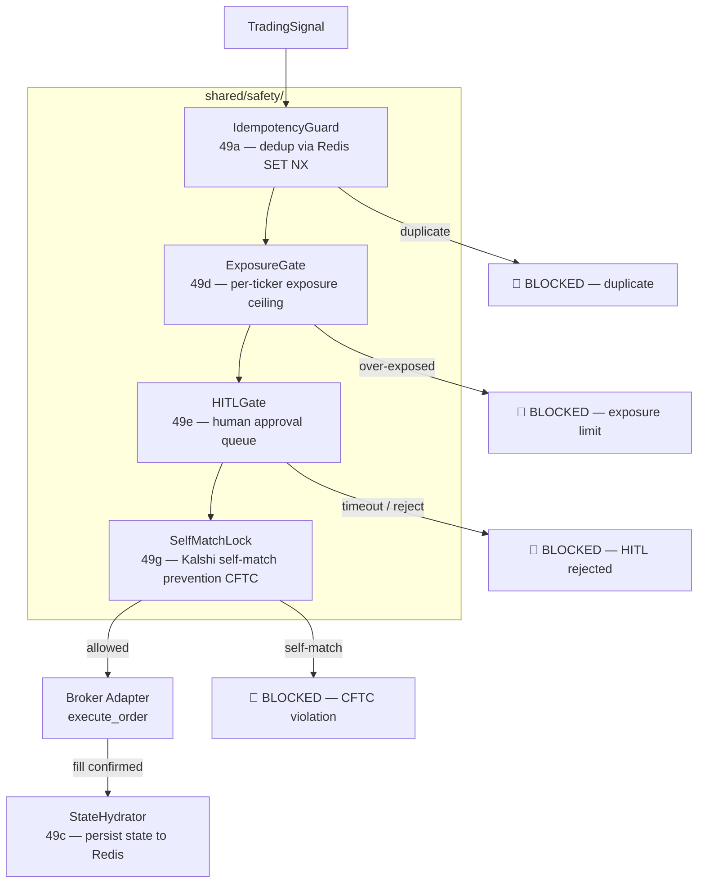

# Pre-Live Safety Hardening

**Step 49** — Defense-in-depth safety layer for the live order path.

Every live order passes through a sequence of guards before reaching a broker API.
Any guard can block the order; all guards are fail-safe by default.

## Architecture



## Sub-systems

### 49a — IdempotencyGuard

Prevents double-fills from network retries or at-least-once delivery.

- **Key**: `idempotency:order:{sha256(canonical)[:16]}`  TTL 24h
- **Canonical**: `ticker|action|confidence|allocation_pct|ts_bucket` (1-minute bucket)
- **Fail-open**: if Redis is unavailable, orders proceed (availability > safety)

```python
guard = IdempotencyGuard(redis_client)
if guard.is_duplicate(ticker, action, confidence, allocation_pct):
    return  # skip — already sent
```

### 49b — Redis Hybrid Persistence

`config/redis.conf` now enforces:

```
appendonly yes               # AOF — 1-second durability
appendfsync everysec
aof-use-rdb-preamble yes    # AOF file starts with RDB snapshot
maxmemory 512mb             # hard cap — eviction policy = noeviction
save 900 1 / 300 10 / 60 10000  # RDB checkpoints
```

Maximum data loss on crash: **1 second** (AOF `everysec`).

### 49c — StateHydrator

Resolves **L1** (engine restarts with empty `executed_trades`).

```python
hydrator = StateHydrator(redis_client)
state = hydrator.hydrate()
engine.executed_trades = state.executed_trades
engine.active_positions = state.active_positions
```

Keys: `quantos:executed_trades` (TTL 24h), `quantos:active_positions` (TTL 1h).

### 49d — ExposureGate

Resolves **C6** (hardcoded $1,000 buying power) and **L2** (exposure never blocks).

- **Fail-closed**: unknown buying power → block order
- **Key**: `safety:exposure:{ticker}`  cumulative spend, TTL 24h
- **Default ceiling**: 10% of buying power per ticker per day
- Set `LIVE_TRADING=true` to require real buying power from adapter

```python
gate = ExposureGate(redis_client, max_exposure_pct=0.10)
if not gate.check(ticker, allocation_pct, buying_power=live_bp):
    return  # blocked
gate.record_fill(ticker, allocation_pct, buying_power=live_bp)
```

### 49e — HITLGate

Pauses execution for human review on high-confidence signals.

- Signals at or above `HITL_CONFIDENCE_FLOOR` (default 0.85) require approval
- Posts to `safety:hitl:pending` (Redis LIST)
- Sends Discord embed if `DISCORD_WEBHOOK_URL` is set
- Auto-rejects after `HITL_TIMEOUT_SECONDS` (default 300)

**Operator approval:**
```bash
redis-cli -a $REDIS_PASSWORD SET safety:hitl:decision:{signal_id} APPROVE
```

### 49f — MFAHandler

Generates Robinhood TOTP codes via `pyotp`.

```bash
pip install pyotp
export ROBINHOOD_MFA_SECRET=JBSWY3DPEHPK3PXP
```

```python
handler = MFAHandler()
code = handler.get_current_code()  # "123456"
```

### 49g — SelfMatchLock

Prevents CFTC-prohibited self-matching on Kalshi prediction markets.

- Records open position direction in `safety:self_match:{market_id}` (TTL 1h)
- Blocks YES↔NO conflicts; allows adding to existing direction

## Issues Resolved

| Issue | Description | Status |
|-------|-------------|--------|
| C6 | Hardcoded $1,000 buying power | **RESOLVED** — ExposureGate queries live BP |
| L1 | fresh_start_pending empty state on restart | **RESOLVED** — StateHydrator |
| L2 | Exposure check never blocked | **RESOLVED** — ExposureGate fail-closed |
