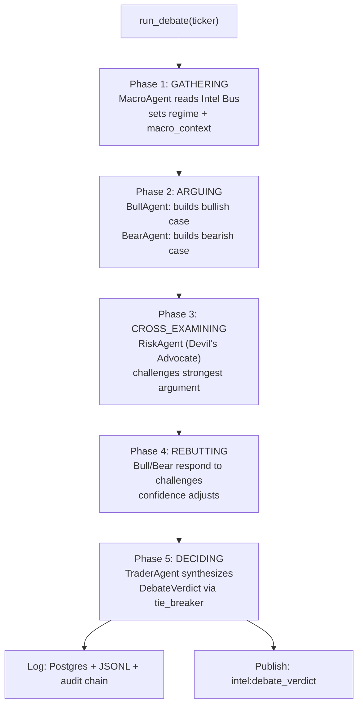

# Devil's Advocate Debate Protocol

**Step 47** — Multi-agent debate topology for high-confidence trade decisions.

## Overview

The Debate Protocol implements a **Shared Blackboard** architecture where five
specialized agents argue for/against a trade. A Devil's Advocate cross-examines
both sides, and a deterministic regime-weighted tie-breaker produces a final verdict.

The entire debate state is auditable via the [Cryptographic Audit Trail](../verification/audit-trail.md).

**No LLM required** — all agents use rule-based deterministic logic.
LLM integration is a future drop-in upgrade to the agent `execute()` methods.

## 5-Phase Debate Flow



## Redis Shared Blackboard

All agents read and write through a single Redis key — no direct agent-to-agent
communication. This eliminates token duplication and enables parallel execution.

```
debate:{session_id}   STRING   Full DebateState JSON   TTL = 3600s
intel:debate_verdict  STRING   Slim VerdictIntel JSON  TTL = 1800s
```

## Agents

| Agent | Phase | Role |
|-------|-------|------|
| MacroAgent | GATHERING | Reads Intel Bus (VIX, spy_trend, FRED, EDGAR alerts, social sentiment) |
| BullAgent | ARGUING | Argues FOR the trade; higher confidence in GREEN regime |
| BearAgent | ARGUING | Argues AGAINST; higher confidence in RED regime |
| RiskAgent | CROSS_EXAMINING | Devil's Advocate: challenges the strongest argument |
| TraderAgent | DECIDING | Synthesizes all arguments → DebateVerdict |

## Significance Scoring

### Agent Confidence

All agents use deterministic confidence: `base(0.5) + confirming_signals × 0.1`.

| Confirming Signal | BullAgent | BearAgent |
|------------------|-----------|-----------|
| GREEN regime | +2 signals | — |
| RED regime | — | +2 signals |
| SPY trend bullish | +1 | — |
| SPY trend bearish | — | +1 |
| VIX ≥ 40 | +1 (contrarian) | +2 |
| Yield curve inverted | — | +1 |
| Insider cluster (Step 17) | +2 | — |

### Regime Caps

- BullAgent in RED regime: confidence capped at 0.55
- BearAgent in GREEN regime: confidence capped at 0.55

## Tie-Breaking

```
GREEN regime: bull_score × 1.2   → favours bulls in rising market
RED regime:   bear_score × 1.2   → favours bears in falling market
YELLOW:       no multiplier       → pure score comparison

margin < 0.10 → HOLD (conservative default)
margin < 0.20 → tie_break_used = True (close call)
```

## Devil's Advocate Challenges

The RiskAgent generates up to 3-4 challenges per debate:

| Vulnerability | Trigger | Target |
|---------------|---------|--------|
| `regime_contradiction` | Bull in RED or Bear in GREEN | Strongest argument |
| `insider_data_ignored` | Insider cluster + bear is winning | BearAgent |
| `single_indicator_concentration` | ≤1 non-regime evidence key | Strongest argument |
| `base_rate_neglect` | No other vulnerabilities found | Strongest argument |

## Output: DebateVerdict

```json
{
  "action": "BUY",
  "ticker": "AAPL",
  "confidence": 0.725,
  "bull_score": 0.650,
  "bear_score": 0.480,
  "regime": "GREEN",
  "regime_multiplier_applied": true,
  "tie_break_used": false,
  "reasoning": "Trader synthesis for AAPL: bull_score=0.650, bear_score=0.480, regime=GREEN...",
  "risk_notes": "1.0x normal position — clear conviction differential"
}
```

## Database

Table `debate_sessions` (migration `20260315120000_add_debate_sessions.sql`):

| Column | Type | Notes |
|--------|------|-------|
| id | UUID | Session ID (UUIDv7) |
| ticker | TEXT | Stock symbol |
| regime | TEXT | GREEN \| YELLOW \| RED |
| verdict | TEXT | BUY \| SELL \| HOLD \| NO_ACTION |
| confidence | NUMERIC | 0.0 – 1.0 |
| bull_score | NUMERIC | Final (post-rebuttal) bull score |
| bear_score | NUMERIC | Final (post-rebuttal) bear score |
| tie_break_used | BOOLEAN | Was it a close call? |
| payload | JSONB | Complete DebateState |
| started_at | TIMESTAMPTZ | Debate start time |

## Archive

`/mnt/archive/debates/YYYY-MM-DD.jsonl` — complete DebateState per line.

## Files

| File | Purpose |
|------|---------|
| `debate_protocol/models.py` | Pydantic v2 models |
| `debate_protocol/blackboard.py` | Redis Shared Blackboard |
| `debate_protocol/tie_breaker.py` | Deterministic regime-weighted scoring |
| `debate_protocol/agents/` | 5 agent implementations |
| `debate_protocol/state_machine.py` | `run_debate()` orchestration |
| `debate_protocol/debate_logger.py` | Multi-output logging |
| `db/migrations/20260315120000_add_debate_sessions.sql` | Schema migration |
| `tests/test_debate_protocol.py` | 57 pure unit tests |
