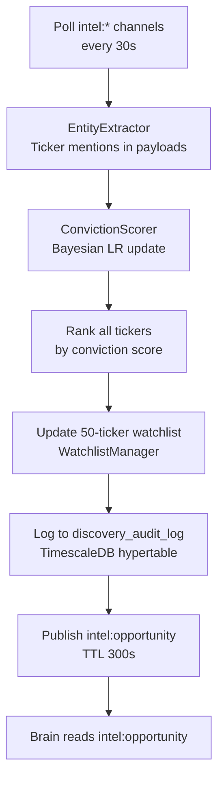

# Opportunity Discovery Engine

The Opportunity Discovery Engine (Step 26.1) is an always-on scanner that watches the Intel Bus for cross-source confluence and surfaces the highest-conviction tickers to the Brain and all engines.

---

## Purpose

- Poll all `intel:*` channels every 30 seconds
- Score tickers using Bayesian logistic regression on multi-source signals
- Maintain a dynamic 50-ticker watchlist, updated in real-time
- Log every discovery event to `discovery_audit_log` (TimescaleDB hypertable)
- Publish top opportunities to `intel:opportunity` (TTL 300s)

---

## Key Files

| File | Role |
|---|---|
| `opportunity_screener/entity_extractor.py` | Extract ticker mentions from Intel Bus payloads |
| `opportunity_screener/conviction_scorer.py` | Bayesian LR conviction scoring |
| `opportunity_screener/watchlist_manager.py` | Dynamic 50-ticker watchlist |
| `opportunity_screener/discovery_logger.py` | Audit log + Intel Bus publishing |
| `opportunity_screener/screener.py` | FastAPI app (:8003) + APScheduler loop |

---

## Discovery Flow

---

## Conviction Scoring

The ConvictionScorer uses Bayesian logistic regression with online updates. Each time a source (FRED, EDGAR, GDELT, social, weather, Kalshi) mentions or flags a ticker, the scorer:

1. Retrieves the prior conviction score for that ticker
2. Updates the posterior using the new signal's strength and source weight
3. Stores the updated score in Redis and Postgres

Source weights:
- EDGAR insider trades: 0.85 (high weight — direct insider knowledge)
- FRED macro indicators: 0.60
- GDELT geopolitical: 0.45
- Kalshi prediction markets: 0.70 (market consensus)
- Social sentiment: 0.40 (noisy but directional)
- Weather signals: 0.35 (specialized, low base rate)

---

## Dynamic Watchlist

The watchlist contains the top 50 tickers by conviction score at any given moment. It is:

- Updated on every 30-second scan cycle
- Persisted to Redis (`screener:watchlist`, TTL 600s)
- Available via `GET /watchlist` API endpoint
- Fed directly into the Playbook's 5-minute scan loop

---

## API Endpoints

| Endpoint | Method | Description |
|---|---|---|
| `/health` | GET | Service health check |
| `/watchlist` | GET | Current 50-ticker dynamic watchlist |
| `/opportunities` | GET | Top opportunities with conviction scores |
| `/discovery-log` | GET | Recent discovery audit log entries |
| `/metrics` | GET | Prometheus metrics |

---

## Storage

| Table | Type | Contents |
|---|---|---|
| `discovery_audit_log` | TimescaleDB hypertable | Every discovery event with timestamp |

Migration: `db/migrations/20260307000003_add_discovery_audit_log.sql`
