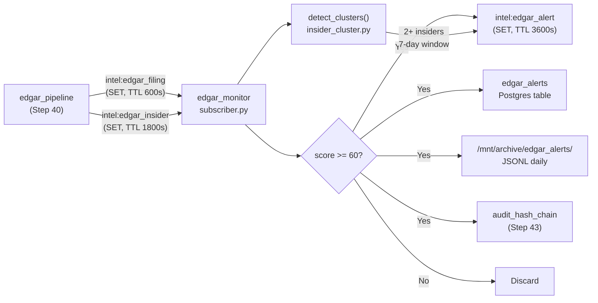

# SEC EDGAR Filing Alerts

**Step 17** — Alert logic on top of the [SEC EDGAR Direct Pipeline](../data-sources/edgar.md).

## Overview

The `edgar_monitor` module subscribes to the Step 40 EDGAR pipeline outputs, scores
each filing for significance, detects insider buying clusters, and publishes actionable
alerts to the Intel Bus.

## Alert Flow



## Significance Scoring

Each filing is scored on a **0–100 scale**. Alerts fire when score ≥ 60.

### Base Scores by Form Type

| Form | Base Score | Alert Triggered? |
|------|-----------|-----------------|
| S-1 | 80 | Yes (always) |
| 8-K | 70 | Yes (always) |
| SC 13D | 65 | Yes (always) |
| SC 13G | 45 | No |
| Form 4 | 50 | No (unless cluster) |
| 10-K | 40 | No |
| 10-Q | 30 | No |
| DEF 14A | 35 | No |

### 8-K Item Boosters

| Item | Meaning | Bonus |
|------|---------|-------|
| 2.02 | Results of Operations (earnings) | +35 |
| 5.02 | Executive departure/appointment | +30 |
| 1.01 | Entry into Material Agreement | +30 |
| 1.02 | Termination of Material Agreement | +25 |
| 2.05 | Exit/Restructuring Costs | +25 |
| 2.01 | Completion of Acquisition | +20 |
| 2.06 | Material Impairments | +20 |
| 4.01 | Auditor Change | +20 |
| 3.01 | Delisting Notice | +15 |
| 8.01 | Other Events | +15 |
| 7.01 | Reg FD Disclosure | +10 |

### Contextual Bonuses

| Condition | Bonus |
|-----------|-------|
| Filed outside market hours (UTC before 14:30 or after 21:00) | +10 |
| Ticker in active watchlist (SPY components, tracked equities) | +10 |

## Insider Cluster Detection

The most reliable EDGAR signal: **two or more insiders buying the same stock within
7 days** indicates insider confidence often not reflected in public information.

### Cluster Scoring

| Condition | Score |
|-----------|-------|
| 2 distinct insiders buying | 70 |
| 3+ distinct insiders buying | 85 |
| CEO or CFO involved | +15 |
| Total purchase value > $500K | +10 |

Only **purchase transactions** (Form 4 transaction type "P") count toward cluster detection.
Sales are ignored.

## Output: EdgarAlert

```json
{
  "alert_id": "019520a0-...",
  "ticker": "NVDA",
  "alert_type": "filing_earnings",
  "significance_score": 100,
  "summary": "8-K filing for NVDA — significance score 100/100 [earnings]",
  "filing_url": "https://www.sec.gov/Archives/edgar/data/.../nvda-20260315.htm",
  "payload": {
    "filing": { "form_type": "8-K", "description": "8-K 2.02 Results...", ... },
    "significance": { "base_score": 70, "boosters": { "item_2.02": 35, "watchlist": 10, "after_hours": 10 }, ... },
    "metrics": { "event_type": "earnings", "item_numbers": ["2.02"], "item_count": 1 }
  },
  "created_at": "2026-03-15T03:00:00+00:00",
  "source_system": "edgar_monitor"
}
```

## Database

Table `edgar_alerts` (migration `20260315100000_add_edgar_alerts.sql`):

| Column | Type | Notes |
|--------|------|-------|
| id | UUID | Primary key (UUIDv7) |
| ticker | TEXT | Stock symbol |
| alert_type | TEXT | filing_significance, insider_cluster, etc. |
| significance_score | INTEGER | 0–100 |
| summary | TEXT | Human-readable one-liner |
| filing_url | TEXT | Nullable — direct EDGAR link |
| payload | JSONB | Full alert details |
| created_at | TIMESTAMPTZ | Alert creation time |

## Integration

`run_monitor_cycle()` in `edgar_monitor/subscriber.py` is designed to be called
from an APScheduler job in the existing `edgar_pipeline` service:

```python
scheduler.add_job(
    run_monitor_cycle,
    trigger="interval",
    seconds=90,
    id="edgar_monitor",
    replace_existing=True,
)
```

## Files

| File | Purpose |
|------|---------|
| `edgar_monitor/alert_rules.py` | Significance scoring engine |
| `edgar_monitor/insider_cluster.py` | Cluster detection algorithm |
| `edgar_monitor/metric_extractor.py` | 8-K item → event type mapping |
| `edgar_monitor/models.py` | Pydantic v2 models |
| `edgar_monitor/subscriber.py` | Redis polling + emit pipeline |
| `db/migrations/20260315100000_add_edgar_alerts.sql` | Schema migration |
| `tests/test_edgar_monitor.py` | 52 pure unit tests |
