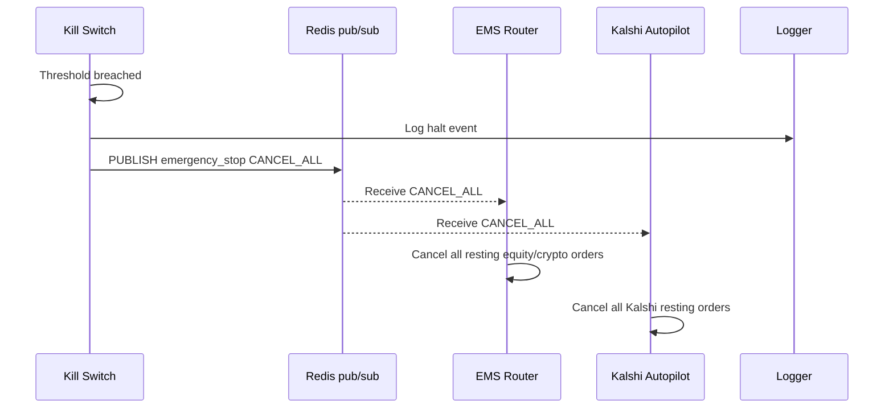

# Kill Switch

The Kill Switch is the circuit breaker for the entire trading system. It monitors five independent health dimensions and publishes a `CANCEL_ALL` halt to the `emergency_stop` Redis channel the moment any threshold is breached.

---

## Design Principle

The Kill Switch must never raise an exception. All Redis operations are wrapped in try/except. If Redis is unreachable when a halt is needed, the Kill Switch logs the failure and returns gracefully — it will retry on the next check cycle.

---

## Trigger Conditions

| Condition | Threshold | Window | Description |
|---|---|---|---|
| **PnL velocity** | −1% NAV/minute | 60s | Rate-of-loss exceeds 1% of NAV per minute |
| **Order rate** | >100 messages | 10s | Anomalously high order message frequency |
| **Connectivity** | >500ms latency | per-check | Exchange API response time exceeded |
| **Price deviation** | >2% from fair value | per-trade | Execution price deviates from mid-market |
| **Master kill** | Manual trigger | instant | `trigger_master_kill()` called directly |

---

## CANCEL_ALL Broadcast



The `emergency_stop` channel is the same channel used by the manual `panic_button.py` script — all halt paths converge on the same Redis pub/sub channel.

---

## PnL Velocity Monitoring

PnL velocity uses a sliding deque of (timestamp, pnl) tuples to compute rate-of-loss:

```python
# Simplified from kill_switch.py
PNL_VELOCITY_WINDOW = 60.0       # seconds
PNL_VELOCITY_THRESHOLD = -0.01   # -1% NAV/minute

def check_pnl_velocity(self, current_pnl: float, nav: float) -> bool:
    self._pnl_log.append((time.time(), current_pnl))
    # Purge entries outside the window
    self._purge_old(self._pnl_log, PNL_VELOCITY_WINDOW)
    if len(self._pnl_log) < 2:
        return False
    rate = (self._pnl_log[-1][1] - self._pnl_log[0][1]) / nav
    return rate < PNL_VELOCITY_THRESHOLD
```

---

## Order Rate Monitoring

Anomalously high order message frequency indicates a runaway loop or message storm. The Kill Switch counts order messages in a 10-second rolling window and halts if the count exceeds 100.

This is distinct from normal high-frequency operation — 100 orders in 10 seconds is approximately one order every 100ms, which is not a valid pattern for the current strategy set.

---

## Integration

The Kill Switch is instantiated in the Playbook runner and can be called from any service that has Redis access:

```python
from trading_playbook.kill_switch import KillSwitch

ks = KillSwitch()
ks.check_all(current_pnl=pnl, nav=portfolio_nav, latency_ms=api_latency)

# Manual emergency halt:
ks.trigger_master_kill(reason="Manual halt — buyer demo")
```

---

## Fail-Silent Design

All Redis publish operations in the Kill Switch are wrapped:

```python
try:
    r.publish("emergency_stop", json.dumps({"action": "CANCEL_ALL", ...}))
except Exception as exc:
    logger.error("[KillSwitch] Redis publish failed: %s", exc)
    # Never re-raise — the kill switch must not crash the caller
```

This ensures the Kill Switch never introduces a new failure mode into a system that is already under stress.
