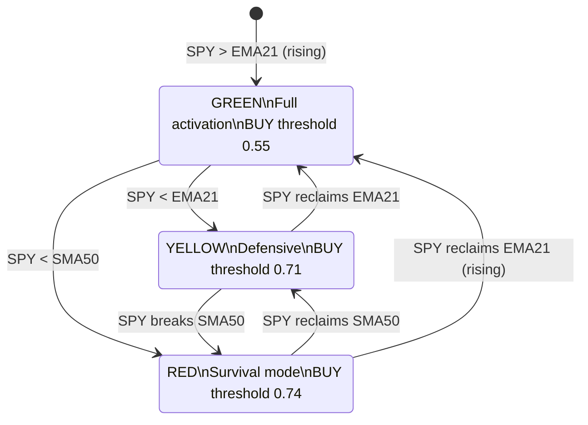

# Macro Regime Classification

The Macro Regime Classifier produces a traffic-light market regime that gates all downstream signal processing. It uses SPY vs. EMA21/SMA50 as the primary signal and JNK/TLT cross-validation to detect false breakouts.

---

## Regime Definitions



| Regime | Condition | Strategy | BUY threshold | SELL/SHORT threshold |
|---|---|---|---|---|
| **GREEN** | SPY > rising EMA21 | Full activation | 0.55 | 0.55 |
| **YELLOW** | SPY < EMA21, SPY > SMA50 | Defensive, no new longs | 0.71 | 0.50 |
| **RED** | SPY < SMA50 | Survival mode, cash or short | 0.74 | 0.45 |

---

## Classification Logic

```python
# Simplified pseudocode from macro_regime.py
EMA_FAST = 21    # EMA lookback
SMA_SLOW = 50    # SMA lookback
EMA_RISING_BARS = 3  # bars to confirm EMA slope

spy_price = latest SPY close
ema21 = ewm(span=21).mean()[-1]
sma50 = rolling(50).mean()[-1]
ema_rising = ema[-1] > ema[-EMA_RISING_BARS]  # is EMA trending up?
jnk_tlt_flag = JNK/TLT cross-validation signal

if spy_price > ema21 and ema_rising:
    regime = "GREEN"
elif spy_price > sma50:
    regime = "YELLOW"
else:
    regime = "RED"
```

---

## JNK/TLT Cross-Validation

When the equity market shows a breakout (GREEN conditions), the classifier checks whether credit markets confirm the move:

- **JNK** (high-yield bond ETF) rising relative to **TLT** (long-term Treasury ETF) = risk-on, breakout confirmed
- JNK underperforming TLT during an equity breakout = likely false move, `jnk_tlt_flag = True`

When `jnk_tlt_flag` is True, the classifier increases the confidence requirement for GREEN-regime BUY signals.

---

## RegimeState Data Model

```python
@dataclass
class RegimeState:
    regime: str          # "GREEN", "YELLOW", or "RED"
    spy_price: float     # latest SPY closing price
    ema21: float         # current 21-day EMA value
    sma50: float         # current 50-day SMA value
    jnk_tlt_flag: bool   # True → credit NOT confirming equity breakout
    confidence: float    # 0.0 – 1.0 classifier confidence
    timestamp: float     # Unix epoch of classification
    reason: str          # human-readable explanation
```

This is published to `intel:macro_regime` (TTL 300s) for consumption by the Brain and all engines.

---

## Catalyst Bonus

In YELLOW and RED regimes, two specific patterns receive a +0.10 confidence bonus:

- **EpisodicPivot** — sudden institutional accumulation even in a weak market
- **InsideBar212** — tight compression signaling a controlled buildup

This bonus allows high-conviction setups to pass the elevated YELLOW/RED thresholds, while preventing low-quality signals from leaking through.

---

## Intel Bus Publishing

The `coach_analyzer` service publishes regime state every **4 minutes** with a **300-second TTL**. This 4-minute publish cycle was established after a production bug where hourly publishing with a 5-minute TTL caused the Brain to receive `nil` for 55 out of 60 minutes. The current schedule ensures at least one refresh before any TTL expiry.

Published keys:
- `intel:macro_regime` — full RegimeState JSON
- `intel:spy_trend` — `"bullish"` / `"neutral"` / `"bearish"`
- `intel:vix_level` — VIX proxy (from Fear & Greed Index when VIX unavailable)
