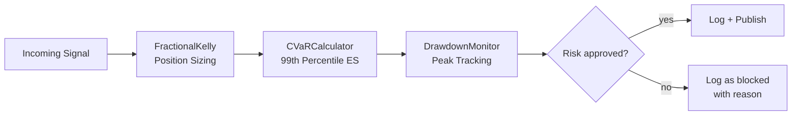

# Risk Engine

The Risk Engine is a pure Python module with no network I/O. It provides three independent risk controls applied in sequence to every playbook signal before it is logged or forwarded.

---

## Components



---

## FractionalKelly

The Fractional Kelly Criterion computes the optimal capital fraction to risk on a single trade, then applies a conservative multiplier (default 25%) to reduce variance from model error.

**Formula:**

```
full_kelly = W - (1 - W) / R
fractional_kelly = full_kelly × fraction

where:
    W = win_rate (fraction of winning trades)
    R = avg_win / avg_loss (reward-to-risk ratio)
    fraction = 0.25 (default)
```

**Bounds:**
- Floor: 0.5% of NAV (minimum meaningful position)
- Ceiling: 10% of NAV (single-position concentration limit)
- `fraction` parameter is capped at 1.0 maximum

**Why 25%?** Full Kelly is mathematically optimal but requires an accurate model. At 25%, the system gives up some theoretical edge in exchange for significantly lower drawdown risk when the model is imperfect — which it always is.

---

## CVaRCalculator

Conditional Value-at-Risk (CVaR), also known as Expected Shortfall, measures the mean of returns in the worst 1% of scenarios. It is more conservative than plain VaR because it captures the magnitude of tail losses, not just the threshold.

**Calculation:**

```python
def compute(self, returns: list[float]) -> float:
    sorted_returns = sorted(returns)
    cutoff_idx = int(len(returns) * (1 - self.confidence))  # 0.99
    tail_returns = sorted_returns[:cutoff_idx]
    return abs(sum(tail_returns) / len(tail_returns))  # mean of worst 1%
```

**Usage:** CVaR is computed from recent Postgres trade history. If CVaR exceeds the configured limit, the signal is blocked and the reason is logged.

The `exceeds_limit()` method accepts both `float` and `int` limits (beartype enforced).

---

## DrawdownMonitor

DrawdownMonitor tracks per-strategy and portfolio-level equity peaks. It triggers hard halts when drawdown from peak exceeds configurable thresholds.

**Tracking logic:**

```python
def record_equity(self, strategy_id: str, equity: float):
    peak = self.peaks[strategy_id]  # tracks running maximum
    if equity > peak:
        self.peaks[strategy_id] = equity
    drawdown = (peak - equity) / peak if peak > 0 else 0.0
    if drawdown > self.halt_threshold:
        self.trigger_halt(strategy_id, drawdown)
```

**Default halt thresholds:**
- Per-strategy: 15% drawdown from strategy equity peak
- Portfolio: 10% drawdown from total NAV peak

When a strategy halt is triggered, it publishes to the Intel Bus and the Kill Switch receives the signal.

---

## beartype Integration

All three risk engine classes have `@beartype` decorators on critical methods. This provides **runtime type enforcement** — passing a string where a float is expected raises a `BeartypeCallHintParamViolation` immediately rather than producing a silent calculation error.

```python
@beartype
def calculate(self, win_rate: float, avg_win: float, avg_loss: float) -> float:
    ...

@beartype
def exceeds_limit(self, returns: list[float], limit: float | int) -> bool:
    ...
```

This is particularly important for financial calculations where type coercion bugs (e.g., integer division) can silently produce incorrect position sizes.
