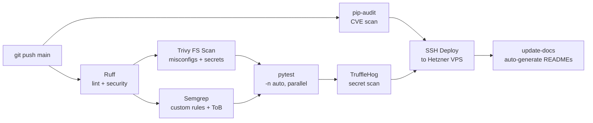

# CI/CD Pipeline

Cemini Financial Suite uses GitHub Actions for continuous integration and SSH-based
deployment to the Hetzner VPS. The pipeline is security-first: every push through
`main` must pass linting, vulnerability scanning, and secret detection before code
reaches the server.

---

## Pipeline Overview



All jobs run on `ubuntu-latest`. Deploy is blocked until `pip-audit` passes. Trivy
and Semgrep are informational (non-blocking) — their SARIF output is uploaded to
GitHub's Security tab.

---

## Job Details

### 1. Ruff (Lint + Security)

```yaml
- name: Run ruff check (lint + security via S rules)
  run: ruff check .
```

Ruff replaces flake8 + bandit. The `S` rule set (bandit-equivalent) catches:
- Hardcoded passwords (`S105`, `S106`)
- `eval()` / `exec()` usage (`S307`)
- `subprocess` with shell=True (`S603`, `S604`)
- Binding to `0.0.0.0` without `# nosec B104` (`S104`)

Configuration: `ruff.toml` at project root. `line-length=120`, selects `E,W,F,B,S,ASYNC,UP,I,N,SIM`.

### 2. pip-audit (Dependency CVE Scan)

```yaml
- name: Run pip-audit (all requirements files)
  run: |
    pip-audit \
      -r requirements.txt \
      -r QuantOS/requirements.txt \
      -r "Kalshi by Cemini/requirements.txt" \
      --strict
```

Scans all three requirements files against the PyPI vulnerability database.
`--strict` fails the job on any CVE. This job **must pass** before deploy proceeds.

### 3. Trivy Filesystem Scan

```yaml
- uses: aquasecurity/trivy-action@master
  with:
    scan-type: fs
    severity: HIGH,CRITICAL
    format: sarif
    output: trivy-fs.sarif
```

Scans the repository filesystem for:
- Misconfigurations in Dockerfiles and docker-compose.yml
- Embedded secrets (API keys, passwords)
- HIGH/CRITICAL CVEs in lockfiles

Results appear in the GitHub Security tab as code scanning alerts.

**Image scanning** runs separately on the VPS via `scripts/trivy-scan.sh` (Docker
builds happen on the server, not in CI runners).

### 4. Semgrep (Static Analysis)

```yaml
- name: Run Semgrep (custom trading rules + Trail of Bits)
  run: semgrep --config .semgrep/ --config p/trailofbits --sarif --output semgrep.sarif .
```

**Custom rules** (`.semgrep/`):

| Rule | Pattern | Risk |
|---|---|---|
| `float-for-money` | `float` used in monetary calculations | Precision loss |
| `rate-limit` | HTTP calls without timeout parameter | Hanging processes |
| `redis-auth` | Redis connection without password | Auth bypass |
| `hardcoded-creds` | String literals matching credential patterns | Secret exposure |

### 5. pytest (Parallel Test Suite)

```yaml
- name: Run test suite (parallel, exclude fuzz)
  run: python3 -m pytest tests/ -v -n auto --ignore=tests/test_api_fuzz.py
```

Fuzz tests are excluded because they require live services.
`-n auto` uses all available CPU cores (typically 2 in GitHub-hosted runners).

### 6. TruffleHog (Secret Scan)

```yaml
- name: TruffleHog Secret Scan (push)
  uses: trufflesecurity/trufflehog@main
  with:
    path: ./
    base: ${{ github.event.repository.default_branch }}
    head: HEAD
    extra_args: --only-verified
```

Scans git history for verified secrets (API keys, tokens, certificates) using
entropy analysis and pattern matching. `--only-verified` reduces false positives.

### 7. SSH Deploy

```yaml
- name: Update Bot on Server
  run: |
    ssh -i ${{ secrets.SSH_KEY }} deploy@5.161.53.103 \
      "cd /opt/cemini && git pull origin main && \
       docker compose up -d --build"
```

Pulls the latest `main` branch and rebuilds/restarts affected containers.
API keys are never stored in the repository — they are in `.env` files on the VPS,
excluded from git via `.gitignore`.

### 8. Auto-Docs (Parallel)

Runs in parallel with the deploy job. Generates README sections from code and
commits with `[skip ci]` to prevent loops.

---

## Semgrep Custom Rules Location

```
.semgrep/
├── float-for-money.yml
├── rate-limit.yml
├── redis-auth.yml
└── hardcoded-creds.yml
```

---

## Security Posture

| Layer | Tool | Enforced |
|---|---|---|
| Code style | Ruff | ✅ Blocking |
| CVE scanning | pip-audit | ✅ Blocking |
| Secret detection | TruffleHog | ✅ Blocking |
| Misconfigurations | Trivy FS | ⚠️ Non-blocking (SARIF) |
| Custom patterns | Semgrep | ⚠️ Non-blocking (SARIF) |
| Runtime types | beartype | ✅ Runtime (23 functions) |

The combination of blocking + informational layers ensures no known CVE or secret
can reach the server, while SARIF reports surface lower-priority issues for review.

---

See also: [DevOps & Security](../infrastructure/devops.md) | [Test Suite Overview](test-suite.md)
