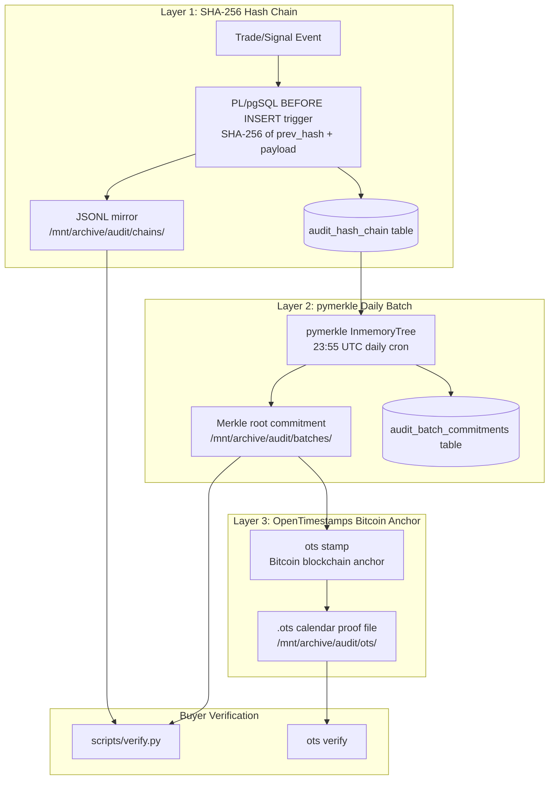

# Cryptographic Audit Trail

The Cryptographic Audit Trail (Step 43) is the most buyer-critical component of Cemini Financial Suite. It proves that the platform's historical trading record cannot be backdated, cherry-picked, or tampered with — a requirement for any IP sale involving claimed performance.

---

## Three-Layer Architecture



---

## Layer 1: SHA-256 Hash Chain

Every event (signal evaluation, trade intent, audit entry) is stored with a cryptographic hash that chains it to the previous entry:

```sql
-- PL/pgSQL BEFORE INSERT trigger (simplified)
NEW.prev_hash = (SELECT chain_hash FROM audit_hash_chain ORDER BY id DESC LIMIT 1);
NEW.chain_hash = encode(
    sha256(
        (NEW.prev_hash || json_canonical(NEW.payload))::bytea
    ),
    'hex'
);
```

**Properties:**
- Any modification to a past entry invalidates all subsequent hashes
- The chain can be verified entirely from the JSONL files — no database required
- Genesis entry has `prev_hash = '0' × 64`

**Tables:**
- `audit_hash_chain` — all audit entries with chained hashes
- `audit_intent_log` — pre-evaluation intents (see below)
- `audit_batch_commitments` — daily Merkle commitments

---

## Layer 2: pymerkle Daily Merkle Tree

At 23:55 UTC each day, an APScheduler cron job:

1. Reads all `audit_hash_chain` entries for the day
2. Builds an `InmemoryTree` from `pymerkle`
3. Computes the Merkle root (commitment to the full day's data)
4. Writes the commitment to `audit_batch_commitments` and `/mnt/archive/audit/batches/YYYY-MM-DD/batches.json`

The Merkle root provides a single 32-byte fingerprint of the entire day's trading activity. Tampering with any entry changes the root.

---

## Layer 3: OpenTimestamps Bitcoin Anchor

OpenTimestamps proves that a piece of data existed at a specific point in time by committing its hash to the Bitcoin blockchain via a calendar server.

```bash
# Stamp a batch file (runs after the daily Merkle job)
ots stamp /mnt/archive/audit/batches/YYYY-MM-DD/batches.json

# Buyer verification
ots verify /mnt/archive/audit/batches/YYYY-MM-DD/batches.json.ots
```

**What it proves:** The `batches.json` file existed at or before the Bitcoin block timestamp. Since Bitcoin blocks are approximately 10 minutes apart and timestamps cannot be set in the past, this proves the data was generated before the block was mined.

**Current status:** The `ots` binary (opentimestamps-client v0.7.2) is installed at `/usr/local/bin/ots`. The system detects it via `shutil.which("ots")` and skips gracefully if not found (non-blocking).

---

## Pre-Evaluation Intent Logging

This is the audit trail's most important anti-cherry-pick mechanism:

```python
# In signal_catalog.scan_symbol() — BEFORE detection
log_intent(
    symbol=symbol,
    signal_type=detector.name,
    scan_timestamp=datetime.now(timezone.utc).isoformat(),
)

# Then detection runs
result = detector.detect(df, symbol)
```

The intent log proves that the system evaluated a ticker before knowing whether a signal would fire. A buyer auditing the chain will see every evaluation attempt — misses, partial signals, and hits — in chronological order.

---

## UUIDv7 Monotonic IDs

All audit entries use UUIDv7 IDs (from the `uuid-utils` package), which encode a millisecond-precision timestamp in the most significant bits. This provides:

- **Monotonic ordering** — UUIDs sort chronologically without a separate timestamp column
- **Gap detection** — large gaps in UUIDv7 sequence indicate missing entries
- **Distributed-safe** — no sequence conflicts if multiple writers insert simultaneously

```python
import uuid_utils
entry_id = str(uuid_utils.uuid7())  # "01954c3a-4e8f-7000-8f3b-..."
```

---

## VCP Silver Tier Schema Compliance

All audit entries follow the VCP Silver Tier naming conventions required for institutional acceptance:

| Field | VCP Convention | Description |
|---|---|---|
| `entry_id` | UUIDv7 | Unique entry identifier |
| `commitment_id` | UUIDv7 | Batch commitment identifier |
| `chain_hash` | SHA-256 hex | Running hash chain value |
| `merkle_root` | SHA-256 hex | Daily Merkle tree root |

---

## Fail-Silent Design

All audit writes are non-blocking. If the audit trail write fails (database unavailable, disk full), the caller continues normally. The failure is logged but never raises an exception:

```python
try:
    write_audit_entry(payload)
except Exception as exc:
    logger.error("[AuditTrail] Write failed: %s", exc)
    # Never re-raise — trading logic must not stop due to audit failure
```

---

## Buyer Verification Procedure

See [Hash Chain Verification](verify-script.md) for the step-by-step buyer verification procedure.
