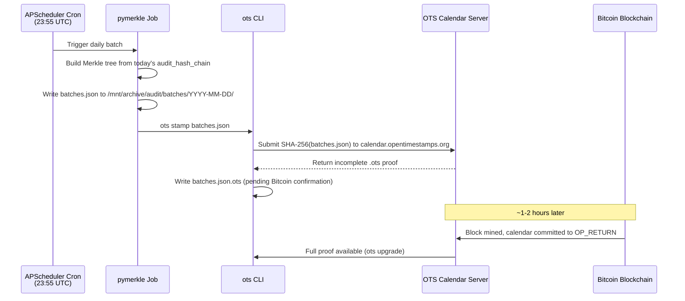

# OpenTimestamps Bitcoin Anchoring

OpenTimestamps (Layer 3 of the Cryptographic Audit Trail) proves that a piece of data
existed at a specific point in time by committing its hash to the Bitcoin blockchain.
This makes the daily Merkle batch impossible to backdate — even if an adversary could
rewrite the Postgres database and JSONL chain files, they cannot rewrite the Bitcoin
blockchain.

---

## What It Proves

An `.ots` proof file proves:

> "This `batches.json` file (or a hash commitment derived from it) was included in a
> Bitcoin block at block height N, mined at approximately timestamp T."

Since Bitcoin blocks are mined with an average 10-minute interval and timestamps are set
by miners within a strict window, this gives a **±2 hour** upper bound on when the data
existed. The data **could not have been created after block N was mined**.

---

## How It Works



The `.ots` file starts as an "incomplete" proof pointing to the calendar server.
After 1–6 Bitcoin blocks (roughly 10 min – 1 hour), the calendar upgrades it to a
full proof with the Bitcoin block hash and Merkle path.

---

## Installation

OpenTimestamps client is installed at `/usr/local/bin/ots`:

```bash
pip install opentimestamps-client
which ots   # → /usr/local/bin/ots
ots --version  # → opentimestamps-client v0.7.2
```

The system detects it via `shutil.which("ots")` and skips gracefully if not found.
In CI environments without internet access, OTS submission is intentionally skipped.

---

## Buyer Verification Procedure

### Step 1 — Install the client

```bash
pip install opentimestamps-client
```

### Step 2 — Locate the batch files

```
/mnt/archive/audit/batches/
├── 2026-03-14/
│   ├── batches.json          ← daily Merkle root + entry hashes
│   └── batches.json.ots      ← OpenTimestamps proof file
├── 2026-03-13/
│   └── ...
```

### Step 3 — Verify a proof

```bash
ots verify /mnt/archive/audit/batches/2026-03-14/batches.json.ots

# Expected output (once the Bitcoin block has been confirmed):
# Success! Bitcoin block ... attests existence as of YYYY-MM-DD HH:MM UTC
```

### Step 4 — Upgrade an incomplete proof

If the `.ots` file was stamped recently and the Bitcoin block hasn't confirmed:

```bash
ots upgrade /mnt/archive/audit/batches/2026-03-14/batches.json.ots
ots verify  /mnt/archive/audit/batches/2026-03-14/batches.json.ots
```

---

## What the Proof Covers

The `.ots` proof anchors the **Merkle root** computed from that day's
`audit_hash_chain` entries. Since the Merkle root is a cryptographic commitment
to all entries, verifying one `.ots` file implicitly proves the entire day's
audit chain.

Combined with the Layer 1 SHA-256 hash chain (see [Cryptographic Audit Trail](audit-trail.md)),
a buyer can verify:

1. **Layer 1**: Every entry chains to the previous (no insertions or deletions)
2. **Layer 2**: The daily Merkle root commits to all entries
3. **Layer 3**: The Merkle root was published to Bitcoin before the trading day ended

This three-layer structure makes retroactive fabrication of a trading track record
computationally infeasible.

---

## Timing Expectations

| Event | Typical Timing |
|---|---|
| Daily batch job runs | 23:55 UTC |
| `ots stamp` submission | ~23:56 UTC |
| Calendar acknowledgment | Immediate (HTTP) |
| First Bitcoin block inclusion | ~10–60 minutes |
| Full proof upgrade available | 1–6 hours post-stamp |
| Proof fully confirmed (6 blocks) | ~1 hour |

---

## Known Limitation

OpenTimestamps relies on the `calendar.opentimestamps.org` public calendar server.
If the calendar is unavailable at stamp time, the system logs a warning and skips
OTS for that day — the Layer 1 and Layer 2 proofs are unaffected. A buyer can
re-stamp any historical `batches.json` file against the calendar retroactively,
but the resulting timestamp will reflect the re-stamp date, not the original date.

For days with successful OTS stamps, the proof is unforgeable.

---

See also: [Cryptographic Audit Trail](audit-trail.md) | [Hash Chain Verification](verify-script.md)
